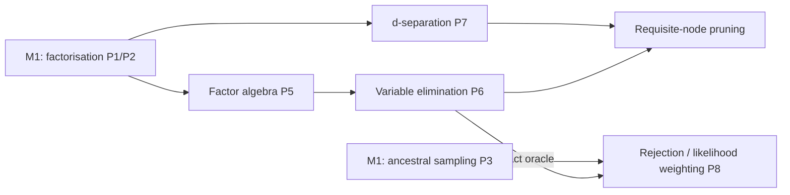

# ProbGraph — Milestone 2 Technical Specification (v1.1)

**Milestone:** Conditional independence, evidence and exact inference.
**Release target:** `v0.2.0`.
**Status:** Accepted 2026-10-09. All §9 decisions are confirmed with their proposed defaults.
**Primary objective:** Answer questions of the form $P(Q\mid E=e)$ and "is $X\perp Y\mid Z$ implied by
the graph?". Do it exactly, from first principles, with each algorithm justified by proofs and by an
oracle that does not depend on the implementation.

---

## 1. What we are building

Milestone 1 could *evaluate* $P(x)$ for one complete assignment and *draw samples* from $P$. It
could not answer questions about some variables when others are observed. Milestone 2 adds three
things:

1. **Factor algebra.** `DiscreteFactor` is a nonnegative table over a set of named variables, with
   product, marginalisation, reduction by evidence and normalisation. A CPD becomes one particular
   kind of factor.
2. **Exact inference by variable elimination.** Compute $P(Q\mid e)$ and $P(e)$ without building
   the joint. The key idea is to push sums inside products:
   $$P(Q, e)=\sum_{x_{\bar Q\bar E}}\ \prod_i \phi_i\Big|_{E=e}.$$
   The sum is over all variables outside $Q\cup E$, and each $\phi_i|_{E=e}$ is a CPD as a factor,
   restricted to the evidence.
3. **d-separation.** Read conditional independences directly from the graph. Check them against
   two oracles: an independent graph criterion, and numerical independence in the distribution
   itself.

An optional final task (§6, task 10) compares the exact answers with **rejection sampling** and
**likelihood weighting**. These reuse the M1 sampler, so it is an approximate-inference bridge
built on existing code.

### Mathematical dependency map



## 2. Scope

| Included in Milestone 2 | Deferred |
|---|---|
| General discrete factors (potentials), including a factor with no variables (a scalar) | Continuous variables |
| Evidence: observing variables at fixed states | Soft or virtual evidence |
| Variable elimination for $P(Q\mid e)$ and $P(e)$ | Junction tree, sum-product message passing (M3) |
| Elimination-order heuristics; induced width | Finding optimal elimination orders (NP-hard) |
| Interaction (moral) graph as an `UndirectedGraph` structure | Undirected *models* (Markov networks) as a model class (M3) |
| d-separation queries (Bayes-ball reachability) | Causal queries, the do-operator |
| Barren-node and requisite-node pruning | MAP / MPE (max-product) |
| Rejection sampling and likelihood weighting (optional task 10) | Gibbs sampling / MCMC (M3) |
| Brute-force enumeration posterior oracle (tests only) | Parameter learning from data |

### Non-negotiable requirements (carried over from M1)

- No pgmpy, NetworkX or other probabilistic-graphical-model library. NumPy only for arrays and
  arithmetic.
- Every algorithm has a written proof in `docs/mathematics/` before it is implemented.
- Tests compare results with an **independent oracle**: brute-force enumeration for numbers, a
  second criterion for graph questions. They never compare the implementation with itself.
- Each unit deliberately breaks its own code to confirm the tests notice ("mutation checks").

---

## 3. Class interfaces and mathematical contracts

### 3.1 `DiscreteFactor`

**Responsibility:** a nonnegative function $\phi:\mathcal X_S\to\mathbb R_{\ge0}$ over a set of
variables $S$ (its *scope*), stored as a table. Unlike a CPD, a factor need not be normalised in any
direction.

```python
class DiscreteFactor:
    def __init__(self, variables: Sequence[DiscreteVariable], values: ArrayLike) -> None: ...
    @classmethod
    def from_cpd(cls, cpd: TabularCPD) -> DiscreteFactor: ...
    @classmethod
    def unit(cls) -> DiscreteFactor: ...            # empty scope, value 1

    variables: tuple[DiscreteVariable, ...]          # axis order
    scope: frozenset[str]
    values: np.ndarray                               # read-only view

    def __mul__(self, other: DiscreteFactor) -> DiscreteFactor: ...
    def marginalise(self, names: Iterable[str]) -> DiscreteFactor: ...   # sum out
    def reduce(self, evidence: Mapping[str, str]) -> DiscreteFactor: ... # restrict, then drop axes
    def normalise(self) -> DiscreteFactor: ...
    def total(self) -> float: ...                     # Σ over all cells
    def value(self, assignment: Mapping[str, str]) -> float: ...
    def aligned(self, order: Sequence[str]) -> DiscreteFactor: ...       # transpose
    def allclose(self, other: DiscreteFactor, atol: float = ...) -> bool: ...  # ignores axis order
```

**Semantics of the product:** $(\phi\psi)(x_{S\cup T})=\phi(x_S)\,\psi(x_T)$. The two tables are
aligned **by variable name** and multiplied with broadcasting. Axis positions are never used for
alignment.

#### Invariants

| ID | Statement |
|---|---|
| F1 | Every entry is finite and $\ge0$. |
| F2 | The variable names in the scope are unique, and the table shape matches their cardinalities exactly. |
| F3 | A variable that appears in both factors must have the same definition in each (as in M1's B6). |
| F4 | A factor's value is a function of the named assignment. Transposing its axes changes nothing observable. |
| F5 | Products are commutative and associative, and `unit()` is the identity. |
| F6 | Marginalising variables in any order gives the same result: $\sum_x\sum_y=\sum_y\sum_x$. |
| F7 | **Distributivity:** if $x\notin\mathrm{scope}(\phi)$ then $\sum_x \phi\,\psi=\phi\sum_x\psi$. |
| F8 | Reduction commutes with product and with marginalising other variables. |
| F9 | `normalise` divides by `total`. If the total is 0 it raises an error; it never returns NaN. |
| F10 | `from_cpd(cpd).marginalise({X})` is the all-ones factor over the parents (C2, restated). |

F7 is the entire reason variable elimination works. F10 is the factor-level form of the step at the
heart of P2.

#### Required tests

- The spec's table operations on hand-built factors, including a scalar factor and singleton
  domains.
- **Algebraic laws on random factors (property tests):** F5, F6, F7, F8. Each law is checked with
  `allclose`, so axis order is ignored.
- $\prod_i$ `from_cpd`$(\mathrm{CPD}_i)$ equals M1's enumerated `joint_table` for random networks.
  This ties M2 to M1.
- Reducing a factor matches slicing the M1 enumeration oracle.
- Mutation checks: aligning tables by axis position instead of by name; summing over the wrong
  axis; `reduce` keeping the observed axis.

### 3.2 `UndirectedGraph` and moralisation

**Responsibility:** the minimal undirected structure needed for elimination analysis and for one of
the d-separation oracles. It also prepares for Markov networks in M3.

```python
class UndirectedGraph:
    def add_node(self, node: str) -> None: ...
    def add_edge(self, u: str, v: str) -> None: ...
    def neighbours(self, node: str) -> set[str]: ...
    def separated(self, xs, ys, given) -> bool: ...   # graph search that avoids `given`

def moral_graph(dag: DAG, restrict_to: Iterable[str] | None = None) -> UndirectedGraph: ...
def interaction_graph(factors: Iterable[DiscreteFactor]) -> UndirectedGraph: ...
```

Moralisation means "marrying" the parents of each node (connecting every pair of them with an
edge) and then dropping edge directions. The interaction graph of the CPD factors **is** the moral
graph. That equality is a test.

### 3.3 `VariableElimination`

**Responsibility:** exact answers to $P(Q\mid e)$ and $P(e)$.

```python
class VariableElimination:
    def __init__(self, model: BayesianNetwork) -> None: ...       # snapshot, like AncestralSampler
    def query(
        self,
        variables: Sequence[str],
        evidence: Mapping[str, str] | None = None,
        elimination_order: Sequence[str] | Literal["min_fill", "min_neighbours", "min_weight"] = "min_fill",
    ) -> DiscreteFactor: ...                                       # normalised, scope == variables
    def probability_of_evidence(self, evidence: Mapping[str, str]) -> float: ...
    def elimination_cost(self, order: Sequence[str], evidence=...) -> EliminationTrace: ...
```

`EliminationTrace` records, for each eliminated variable, the scope of the intermediate factor it
creates. From this come the induced width and the largest table size. Tests use it to show that the
elimination order changes the **cost** but never the **answer**.

#### Algorithm (sum-product variable elimination)

1. $\Phi\leftarrow\{\texttt{from\_cpd}(c).\texttt{reduce}(e)\}$ for every CPD $c$.
2. For each $Z$ in the elimination order: multiply every factor in $\Phi$ whose scope contains $Z$,
   sum $Z$ out of the product, and replace those factors with the result.
3. Multiply the factors that remain. The result $\tau$ has scope $Q$.
   $P(e)=\tau.\texttt{total}()$ and $P(Q\mid e)=\tau.\texttt{normalise}()$.

#### Invariants

| ID | Statement |
|---|---|
| V1 | **Exactness:** the result equals brute-force enumeration (within `atol=1e-12`) for every query, every evidence set and every valid order. |
| V2 | **Order independence:** every elimination order gives the same answer. |
| V3 | The result has scope exactly $Q$, in the order requested. |
| V4 | The query and evidence variables are known, disjoint and assigned valid states. Otherwise the query is rejected. |
| V5 | Evidence with $P(e)=0$ raises `ZeroProbabilityEvidenceError`. It never returns NaN. |
| V6 | With no evidence, the query returns the prior marginal, and `probability_of_evidence({})` is 1. |
| V7 | **Barren-node pruning** preserves answers. A leaf outside $Q\cup E$ can be deleted repeatedly (by P2, corollary C-a). |
| V8 | The induced width measured from the trace equals the width predicted from the interaction graph for the same order. |

#### Required tests

- Fixture posteriors (§4) against hand-derived values.
- **Random networks × random queries × random evidence × random orders**, all checked against the
  enumeration oracle (V1, V2).
- **Cost depends on order (naive Bayes, $n$ features):** eliminating the class first creates a
  factor over all $n$ features, with $2^n$ cells. Eliminating the features first never exceeds 2
  cells. Both orders must give identical answers.
- Pruned and unpruned elimination agree (V7).
- Mutation checks: skipping `reduce`, or reducing only some factors; dropping a factor that does not
  mention the variable being eliminated; normalising the intermediate factors.

### 3.4 d-separation

**Responsibility:** decide from the graph alone whether $X\perp Y\mid Z$ holds in **every**
distribution that factorises over $G$.

```python
class DAG:
    def d_separated(self, xs: Iterable[str], ys: Iterable[str], given: Iterable[str] = ()) -> bool: ...
    def d_connected_nodes(self, x: str, given: Iterable[str] = ()) -> set[str]: ...  # Bayes ball
```

**Algorithm:** the linear-time reachability procedure ("Bayes ball", Koller & Friedman Alg. 3.1).
It walks trails and tracks the direction of arrival at each node. Rules: a chain or fork node blocks
the trail when it is observed. A collider passes the trail only when it, or one of its descendants,
is observed.

#### Invariants

| ID | Statement |
|---|---|
| D1 | Symmetry: $\mathrm{dsep}(X,Y\mid Z)=\mathrm{dsep}(Y,X\mid Z)$. |
| D2 | $X$, $Y$ and $Z$ must be disjoint; unknown nodes are rejected. |
| D3 | Agreement with the **moralised ancestral graph** criterion: $X\perp_G Y\mid Z$ exactly when $Z$ separates $X$ from $Y$ in the moral graph of $\mathrm{An}(X\cup Y\cup Z)$. |
| D4 | **Soundness (numerical):** if d-separated, then $P(x,y\mid z)=P(x\mid z)P(y\mid z)$ in every random network on $G$. |
| D5 | **Completeness for generic parameters (numerical):** if not d-separated, then random Dirichlet CPDs give measurable dependence. |
| D6 | The graphoid axioms hold: decomposition, weak union and contraction. |

#### Required tests

- The three canonical structures: chain, fork and collider. A collider is opened by observing it
  *or one of its descendants*.
- **Exhaustive agreement on all small DAGs** (every DAG with ≤ 5 nodes up to labelling, every
  $(X,Y,Z)$ triple): Bayes ball against the moral-ancestral criterion (D3).
- D4 and D5 on random networks, using the enumeration oracle.
- The fixture facts in §4.
- Mutation checks: treating colliders like chains; ignoring descendants of colliders.

### 3.5 Requisite-node pruning

This is an optional optimisation inside `VariableElimination`, and it has a proof obligation. When
evidence is d-separated from the query given the rest of the evidence, it is *irrelevant* and can be
dropped. Barren nodes can be dropped too (V7). The test is that every answer is unchanged.

### 3.6 Approximate inference (optional task 10)

```python
class RejectionSampler:  def query(self, variables, evidence, n, seed) -> ApproximatePosterior: ...
class LikelihoodWeighting: def query(self, variables, evidence, n, seed) -> ApproximatePosterior: ...
```

`ApproximatePosterior` carries the estimate, the number of accepted samples (or the effective
sample size), and a confidence bound.

| ID | Statement |
|---|---|
| A1 | Rejection sampling accepts with probability exactly $P(e)$. The accepted samples are exact draws from $P(\cdot\mid e)$. |
| A2 | The likelihood-weighting weights $w=\prod_{E_i}p(e_i\mid\mathrm{pa}_i)$ lie in $[0,1]$, and $\mathbb E[w]=P(e)$ (the estimator is unbiased). |
| A3 | The likelihood-weighting posterior is a ratio estimator. It is consistent, but biased for finite $n$. |

**Tests:** frequency checks against the exact VE answers. Because $w\in[0,1]$, M1's Bernstein bound
applies directly to $\hat P(e)$. The posterior is bounded by applying it to the numerator and the
denominator and combining them with a union bound. Also: rejection sampling's efficiency collapses
as $P(e)\to0$, and likelihood weighting's effective sample size degrades when evidence sits
downstream of the variables it depends on.

---

## 4. Mathematical test fixture

Extend the M1 network with two binary children. **Late** depends on Traffic, and **Umbrella** on
Rain:

```
   Umbrella ← Rain → Traffic ← Accident
                        ↓
                       Late
```

| New CPD | Values |
|---|---|
| $P(L=1\mid T)$ | $T=0$: 0.1; $T=1$: 0.6 |
| $P(U=1\mid R)$ | $R=0$: 0.1; $R=1$: 0.85 |

The fixture has $1+1+4+2+2=10$ free parameters, against 31 for an unrestricted joint. All values
below were computed by enumeration with the v0.1.0 library.

| Quantity | Exact | Decimal | What it demonstrates |
|---|---|---|---|
| $P(L=1)$ | $1113/4000$ | 0.27825 | a prior marginal through two layers |
| $P(A=1\mid L=1)$ | $65/371$ | 0.175202 | evidence flows *up* through a descendant of the collider |
| $P(A=1\mid L=1,U=1)$ | $475/3787$ | 0.125429 | explaining away **two edges away**: the umbrella points to rain, and rain explains the lateness |
| $P(A=1\mid L=1,U=0)$ | $275/1211$ | 0.227085 | no umbrella, so an accident is the more likely cause |
| $P(A=1\mid U=1)$ | $1/10$ | 0.1 | $A\perp U$ marginally |
| $P(R=1\mid U=1)$ | $51/65$ | 0.784615 | diagnostic reasoning (child to parent) |
| $P(A=1\mid T=1,U=1)$ | $1165/8761$ | 0.132976 | compare $P(A=1\mid T=1)=5/23\approx0.217391$ |
| $P(L=1,U=1)$ | $11361/80000$ | 0.1420125 | target for `probability_of_evidence` |

Every CPD entry is a short decimal, so every value is rational. Tests compare against the exact
fractions with `atol=1e-12`. (Spec v1.0 printed $P(L=1,U=1)$ rounded to 0.142012, which is exactly
at the edge of a $\pm5\times10^{-7}$ tolerance. Corrected in v1.1.)

**d-separation facts, each checked numerically against the joint:**

| Statement | Holds? | Reason |
|---|---|---|
| $A\perp R$ | yes | the collider $T$ is unobserved |
| $A\perp R\mid T$ | **no** | observing the collider opens the trail |
| $A\perp R\mid L$ | **no** | observing a *descendant* of the collider opens it too |
| $A\perp U\mid L$ | **no** | trail $A\to T\leftarrow R\to U$, opened at $T$ through $L$ |
| $A\perp L\mid T$ | yes | chain blocked at $T$ |
| $U\perp L\mid R$ | yes | fork blocked at $R$ |
| $U\perp L\mid T$ | yes | blocked at $T$ (a chain node there) |
| $U\perp A\mid T$ | **no** | collider $T$ observed, and $R$ unobserved |
| $U\perp A\mid T,R$ | yes | $R$ blocks the only open trail |

### The first derivation (do this by hand before writing VE)

$$P(A,L{=}1)=P(A)\sum_r P(r)\Big[\sum_u P(u\mid r)\Big]\sum_t P(t\mid r,A)\,P(L{=}1\mid t)$$

- The bracket is 1 by C2: $U$ is a **barren node**. This is why pruning is exact (V7).
- Each inner sum creates a new factor: $\tau_1(r,A)=\sum_t P(t\mid r,A)P(L{=}1\mid t)$, then
  $\tau_2(A)=\sum_r P(r)\tau_1(r,A)$.
- Normalising $P(A)\tau_2(A)$ gives $P(A=1\mid L=1)=65/371\approx0.175202$.

---

## 5. Proofs required

| Proof | Content |
|---|---|
| **P5 Factor algebra** | Product and marginalisation are well defined on named scopes. Commutativity and associativity, sums commuting with each other (Fubini for finite sums), and **distributivity F7**. Reduction equals multiplying by an indicator function. |
| **P6 Variable elimination** | Correctness by induction on the elimination steps, using F7. Order independence. Cost $O(n\cdot d^{w+1})$ for induced width $w$. Why barren nodes vanish (P2 C-a). That optimal ordering is NP-hard (stated with a citation, not proved). |
| **P7 d-separation** | **Soundness** proved through the moralised ancestral graph: factorisation over $G$ implies factorisation over the ancestral moral graph, and separation there implies independence. **Completeness for generic parameters**: stated, with a proof sketch (the dependent parameters form a measure-zero set) and a citation (Meek 1995). The equivalence of Bayes ball and the moral-ancestral criterion. |
| **P8 Sampling-based inference** *(with task 10)* | Rejection sampling as exact conditioning. Likelihood weighting as importance sampling with proposal "evidence clamped, other variables sampled from their CPDs". Unbiasedness of $\hat P(e)$; consistency of the ratio estimator. |

New files: `docs/mathematics/factor_algebra.md`, `variable_elimination.md`, `d_separation.md`,
`sampling_inference.md`.

---

## 6. Implementation sequence

| # | Task | Completion criterion |
|---|---|---|
| 1 | **Factor algebra:** `DiscreteFactor`, product, marginalise, reduce, normalise, scalar factors | F1–F10 property tests pass |
| 2 | **CPDs as factors:** `from_cpd`; product of CPD factors equals M1's joint | Matches `joint_table` on random networks |
| 3 | **Evidence and posterior oracle:** evidence validation; enumeration-based $P(Q\mid e)$ in `tests/support.py` | Fixture table in §4 reproduced |
| 4 | **Variable elimination** with an explicit order | V1, V3–V6 pass |
| 5 | **Interaction graph and heuristics:** `UndirectedGraph`, `moral_graph`, min-fill/min-neighbours/min-weight, `EliminationTrace` | V2, V8; naive-Bayes cost demonstration |
| 6 | **Barren-node pruning** | V7 |
| 7 | **d-separation** (Bayes ball) | Canonical structures and fixture table |
| 8 | **d-separation oracles:** moral-ancestral criterion; exhaustive small-DAG agreement; numerical soundness and completeness | D1–D6 |
| 9 | **Requisite-node pruning** using d-separation | Answers unchanged on random queries |
| 10 | *(optional)* **Rejection sampling and likelihood weighting** | A1–A3 checked against VE |
| 11 | **Package and document v0.2.0:** proofs, example, README, changelog, green CI | Fresh-install CI passes |

The two tracks are independent until task 9: factors and VE (tasks 1–6), and d-separation (tasks
7–8). They can be done in either order. The recommended order keeps them as listed, because VE
gives the numerical oracle that D4/D5 can reuse.

Each task follows the same cycle as M1: **derive → specify → implement test-first → mutation
check → reflect.**

---

## 7. Acceptance criteria for Milestone 2

Evidence for each item is mapped in the README's "Milestone 2 acceptance" table.

- [x] The factor algebra laws (F5–F8) hold on random factors.
- [x] The product of CPD factors reproduces the M1 joint distribution.
- [x] VE matches enumeration on every random query/evidence/order combination tested.
- [x] The elimination order changes cost (demonstrated) but never answers.
- [x] Zero-probability evidence fails explicitly.
- [x] d-separation agrees with the moral-ancestral criterion on every DAG with ≤ 5 nodes.
- [x] d-separation is numerically sound, and generically complete, on random networks.
- [x] Pruning (barren and requisite nodes) never changes an answer.
- [x] Proofs P5–P7 (and P8 if task 10 is done) are documented.
- [ ] `v0.2.0` installs fresh and passes CI. *(Ticked when the tagged commit's CI run passes.)*

---

## 8. Repository additions

```
src/probgraph/
├── factors/
│   ├── __init__.py
│   └── discrete_factor.py
├── graphs/
│   ├── undirected.py          # UndirectedGraph, moral_graph, interaction_graph
│   └── dag.py                 # + d_separated, d_connected_nodes
├── inference/
│   ├── __init__.py
│   ├── elimination_order.py   # heuristics, EliminationTrace
│   └── variable_elimination.py
└── sampling/
    └── inference.py           # (task 10) RejectionSampler, LikelihoodWeighting
tests/
├── test_factors.py
├── test_undirected.py
├── test_variable_elimination.py
├── test_d_separation.py
└── test_sampling_inference.py # (task 10)
docs/mathematics/
├── factor_algebra.md
├── variable_elimination.md
├── d_separation.md
└── sampling_inference.md      # (task 10)
examples/
└── late_for_work.py           # the extended fixture: inference and explaining away
```

---

## 9. Decisions (accepted 2026-10-09)

| ⚑ | Decision | Accepted | Why |
|---|---|---|---|
| 1 | Include task 10 (approximate inference)? | **Yes, but last and cuttable** | Reuses M1 sampling; exact VE is a perfect oracle for it; P8 is short |
| 2 | Spelling of method names | **British** (`marginalise`, `normalise`) | Matches the docs and `NORMALISATION_ATOL`; consistent within the project |
| 3 | What `query` returns | **A normalised `DiscreteFactor`** | Composable, keeps named axes; a `.to_dict()` helper is enough for display |
| 4 | Factor axis order | **Keep construction order; compare with `allclose`** | Matches the M1 CPD convention; avoids hidden sorting costs |
| 5 | Zero-probability evidence | **Raise `ZeroProbabilityEvidenceError`** | Consistent with "never silently return NaN" |
| 6 | Query and evidence overlap | **Reject** | $P(X\mid X=x)$ is trivial and usually a caller bug |
| 7 | Log-space factors | **Not in M2**; document underflow limits | Small networks are fine in float64; log-space arrives with M3 message passing |
| 8 | Is `UndirectedGraph` public? | **Yes, minimal** | Needed for heuristics and the d-separation oracle now; it becomes the base for Markov networks in M3 |
| 9 | Tie-breaking in heuristics | **Insertion order, as in `DAG.topological_sort`** | Deterministic traces, so cost tests are reproducible |

---

## 10. Where to begin

Start with **task 1** (factor algebra), and before writing any code, derive F7 (distributivity) and
the fixture computation in §4 by hand:

$$P(A,L{=}1)=P(A)\sum_r P(r)\Big[\sum_u P(u\mid r)\Big]\sum_t P(t\mid r,A)\,P(L{=}1\mid t).$$

Write down which factor each sum creates, and its scope. Those scopes are exactly what
`EliminationTrace` will record, and the bracket that disappears is barren-node pruning. Once that is
clear, the class `DiscreteFactor` is just the minimal data structure that makes those four lines
mechanical.

**Next implementation unit:** `M2.1 — DiscreteFactor`, starting with `docs/mathematics/factor_algebra.md`.

---

### Looking ahead to Milestone 3 (not committed)

Junction-tree / sum-product message passing (reusing `UndirectedGraph`, factor algebra and VE as an
oracle), Markov networks, Gibbs sampling (reusing likelihood weighting as a baseline), and
log-space numerics. Parameter learning (maximum likelihood and Dirichlet priors from sampled data)
is an alternative M3 theme. It would close the loop with M1's sampler: generate data, then learn
the CPDs back.
