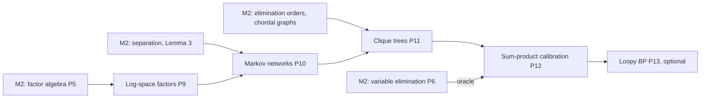

# ProbGraph — Milestone 3 Technical Specification (v1.3)

**Milestone:** Message passing: Markov networks, clique trees and belief propagation.
**Release target:** `v0.3.0`.
**Status:** Accepted 2026-10-09. All §9 decisions are confirmed with their proposed defaults.
**Primary objective:** Compute **every** marginal of a model, under evidence, in one pass of
messages over a clique tree. Extend the library from directed to undirected models. Make all of
it numerically robust by working in log space. Each step gets a proof and an independent oracle,
as in M1 and M2.

---

## 1. What we are building

Variable elimination (M2) answers one query at a time. Asking for all $n$ single-variable
marginals repeats almost all of the work $n$ times. Message passing organises the *same* sums
(P6) on a tree of cliques, so that two sweeps of messages, one inward and one outward, deliver
every marginal at once. M3 adds four things:

1. **Log-space factors.** M2's variable elimination underflows. In a naive-Bayes model with
   1,100 observed features, the true $P(e)\approx10^{-341}$, below float64's smallest positive
   number (about $10^{-324}$). Depending on the order of the evidence, M2 either reports
   $P(e)=0$ and **raises `ZeroProbabilityEvidenceError` for evidence that is possible**, or keeps
   a subnormal leftover ($5\times10^{-324}$) and **silently returns a wrong posterior**, $[0,1]$
   where the truth is exactly $[0.5,0.5]$. Both were verified with v0.2.0 (the second during
   M3.2). Log-space factors fix both with log-sum-exp.
2. **Markov networks.** An undirected model class,
   $P(x)=\frac1Z\prod_C\phi_C(x_C)$, including the partition function $Z$, the global Markov
   property, and the conversion from a Bayesian network by moralisation.
3. **Clique trees (junction trees).** Triangulate the interaction graph using the M2
   elimination orders, extract the maximal cliques, and connect them into a tree with the
   **running intersection property**.
4. **Sum-product message passing (Shafer–Shenoy).** Calibrate the tree. Every clique belief
   becomes $\propto P(C,e)$, and every single-variable marginal is read off from a small clique.

An **optional** final task adds **loopy belief propagation**: the same messages on a graph with
cycles. It is approximate, exact on trees, and can fail to converge. The exact engine is its
oracle.

### Mathematical dependency map



## 2. Scope

| Included in Milestone 3 | Deferred |
|---|---|
| Log-space factors (log-sum-exp) and a log-space option for variable elimination | Arbitrary-precision arithmetic |
| `MarkovNetwork` with partition function, conditional queries, and separation | Conditional random fields; log-linear features |
| Bayesian network → Markov network conversion (moralisation) | Markov network → Bayesian network conversion |
| Triangulation, maximal cliques, clique-tree construction | Optimal triangulation (NP-hard) |
| Shafer–Shenoy sum-product calibration; all marginals; evidence; $Z$ / $P(e)$ | Hugin propagation (as a library feature) |
| Queries over variables inside a single clique | Out-of-clique joint queries (use variable elimination) |
| *(optional)* Loopy belief propagation with damping | Generalised BP, Bethe free energy optimisation |
| | MAP / max-product, MCMC, learning, continuous variables |

### Non-negotiable requirements (carried over)

- No probabilistic-graphical-model or graph library. NumPy only for arrays and arithmetic.
- Every algorithm has a written proof in `docs/mathematics/` before it is implemented.
- Results are checked against an **independent oracle**: enumeration for small models, M2
  variable elimination for larger ones, and brute-force graph checks for structure.
- Each unit deliberately breaks its own code to confirm the tests notice ("mutation checks"),
  and every gap found is fixed. Surviving mutants must be explained, either as equivalent or as
  a documented limitation.
- No Claude attribution in commits. Commits are authored as the repository owner.

---

## 3. Class interfaces and mathematical contracts

### 3.1 Log-space factors

```python
class LogFactor:
    def __init__(self, variables: Sequence[DiscreteVariable], log_values: ArrayLike) -> None: ...
    @classmethod
    def from_factor(cls, phi: DiscreteFactor) -> LogFactor: ...   # log(0) = -inf, allowed
    def to_factor(self) -> DiscreteFactor: ...                    # may underflow; documented
    def __mul__(self, other: LogFactor) -> LogFactor: ...         # adds log values
    def marginalise(self, names: Iterable[str]) -> LogFactor: ... # log-sum-exp
    def reduce(self, evidence: Mapping[str, str]) -> LogFactor: ...
    def log_total(self) -> float: ...                             # log Z; -inf if all zero
    def normalise(self) -> LogFactor: ...                         # raises if log_total == -inf
    # names, scope, value / log_value, aligned, allclose: as for DiscreteFactor
```

| ID | Statement |
|---|---|
| L1 | Entries are finite or $-\infty$, never NaN or $+\infty$. $-\infty$ encodes a structural zero. |
| L2 | `LogFactor.from_factor(φ).to_factor()` equals φ wherever no underflow occurs. |
| L3 | Every operation corresponds exactly to its `DiscreteFactor` counterpart under $\exp$ (P5 laws transfer). |
| L4 | **Stability:** log-sum-exp never overflows; an all-$-\infty$ slice gives $-\infty$, not NaN. |
| L5 | `VariableElimination` (log space, the default since v0.3.0) answers the 1,100-feature query exactly as $[0.5,0.5]$ and returns $\log P(e)$ correctly where M2 returned 0 or a wrong posterior. |

### 3.2 `MarkovNetwork`

```python
class MarkovNetwork:
    def __init__(self, variables: Sequence[DiscreteVariable], factors: Iterable[DiscreteFactor]) -> None: ...
    graph: UndirectedGraph                      # the interaction graph of the factors
    def log_partition_function(self) -> float: ...
    def partition_function(self) -> float: ...  # may overflow; raises rather than returning inf
    def probability(self, assignment: Mapping[str, str]) -> float: ...
    def query(self, variables, evidence=None) -> DiscreteFactor: ...   # by log-space VE
    def separated(self, xs, ys, given=()) -> bool: ...

BayesianNetwork.to_markov_network() -> MarkovNetwork
```

| ID | Statement |
|---|---|
| M1 | Every factor's variables are model variables, with the canonical definitions (as M1's B6). |
| M2 | $Z>0$. A model whose factors admit no positive assignment is rejected when $Z$ is first computed. |
| M3 | `probability(x)` $=\prod_C\phi_C(x_C)/Z$, and it sums to 1 (enumeration oracle). |
| M4 | **Global Markov property:** separation in `graph` implies numerical conditional independence (M2's Lemma 3). |
| M5 | `bn.to_markov_network()` has graph = moral graph, $Z=1$, and the same joint distribution. |
| M6 | The conversion is an I-map but not always a perfect map: the collider independence $A\perp R$ holds in the BN but is **not** a separation in the moral graph. Demonstrated, not hidden. |

### 3.3 Triangulation and clique trees

```python
def triangulate(graph: UndirectedGraph, order: Sequence[str]) -> UndirectedGraph: ...  # graph + fill edges
def is_chordal(graph: UndirectedGraph) -> bool: ...          # maximum cardinality search
def maximal_cliques(chordal: UndirectedGraph) -> list[frozenset[str]]: ...

class CliqueTree:
    cliques: tuple[frozenset[str], ...]
    edges: tuple[tuple[int, int], ...]
    def separator(self, i: int, j: int) -> frozenset[str]: ...
    @classmethod
    def from_elimination(cls, graph, order) -> CliqueTree: ...
```

| ID | Statement |
|---|---|
| J1 | The cliques form a **tree**: connected, with exactly $k-1$ edges for $k$ cliques. |
| J2 | **Running intersection:** for each variable, the cliques containing it form a connected subtree. |
| J3 | Every clique is a maximal clique of the triangulated graph, and every edge of the original graph lies inside some clique. |
| J4 | The triangulated graph is chordal and contains the original graph. Checked by maximum cardinality search, not by the code that built it. |
| J5 | The width (max clique size − 1) equals the M2 `simulate_elimination` width for the same order. |
| J6 | **Family preservation:** each model factor is assigned to exactly one clique that contains its scope. |

### 3.4 Sum-product calibration (Shafer–Shenoy)

```python
class JunctionTree:
    def __init__(self, model: BayesianNetwork | MarkovNetwork, evidence=None,
                 elimination_order: Sequence[str] | Heuristic = "min_fill") -> None: ...
    tree: CliqueTree
    def marginal(self, variable: str) -> DiscreteFactor: ...          # normalised
    def marginals(self) -> dict[str, DiscreteFactor]: ...             # every unobserved variable
    def query(self, variables: Sequence[str]) -> DiscreteFactor: ...  # must lie in one clique
    def clique_belief(self, i: int) -> LogFactor: ...                 # ∝ P(C_i, e)
    def log_probability_of_evidence(self) -> float: ...               # log P(e), or log Z·P(e) for MNs
    def message_count(self) -> int: ...                               # 2(k-1) after calibration
```

Message from clique $i$ to its neighbour $j$:
$$\delta_{i\to j}(S_{ij})=\sum_{C_i\setminus S_{ij}}\ \psi_i\prod_{k\in N(i)\setminus\{j\}}\delta_{k\to i}.$$
Belief: $\beta_i=\psi_i\prod_{k\in N(i)}\delta_{k\to i}$. Messages are computed in log space,
with an inward sweep to a root followed by an outward sweep.

| ID | Statement |
|---|---|
| C1 | Exactly $2(k-1)$ messages are computed, each exactly once. |
| C2 | **Calibration:** neighbouring beliefs agree on their separator, $\sum_{C_i\setminus S}\beta_i=\sum_{C_j\setminus S}\beta_j$. |
| C3 | $\beta_i\propto P(C_i,e)$, equal to M2 variable elimination on $C_i$ after normalisation. |
| C4 | Every clique has the same total: $\log\sum\beta_i=\log P(e)$ (or $\log Z_e$ for Markov networks). |
| C5 | Every single-variable marginal equals variable elimination and enumeration. |
| C6 | The result does not depend on the choice of root or the order within a sweep. |
| C7 | **Cost** (revised in M3.7, after measurement): with **downstream evidence**, one calibration answers all $n$ marginals with far fewer table cells than $n$ separate pruned VE queries, and it always beats unpruned VE. Without evidence, pruned VE can be cheaper on sparse DAGs. That is measured and documented (message_passing.md §9), not hidden. |
| C8 | Evidence with $P(e)=0$ raises `ZeroProbabilityEvidenceError`; tiny but positive $P(e)$ does not (L5). |

### 3.5 *(optional)* Loopy belief propagation

```python
class LoopyBeliefPropagation:
    def __init__(self, model: MarkovNetwork, damping: float = 0.0,
                 max_iterations: int = 200, tolerance: float = 1e-10) -> None: ...
    def run(self, evidence=None, seed: int | None = None) -> LoopyResult: ...  # beliefs, converged, iterations
```

| ID | Statement |
|---|---|
| B1 | On a tree-structured model it converges, and its beliefs equal the exact marginals. |
| B2 | On a cycle it reaches a fixed point that differs from the exact marginals by a measured, reported amount. |
| B3 | A documented non-convergence example oscillates without damping and converges with it. |
| B4 | It never reports `converged=True` unless the message change is below `tolerance`. |

---

## 4. Mathematical test fixtures

**F1: the M2 Late/Umbrella network** (reused). Its moral graph is already chordal, with cliques
$\{R,A,T\}$, $\{T,L\}$ and $\{R,U\}$, and separators $\{T\}$ and $\{R\}$. One calibration must
reproduce every exact fraction in the M2 §4 table at once, for example
$P(A{=}1\mid L{=}1)=65/371$.

**F2: the misconception network** (Koller & Friedman, §4.1). Four students on a 4-cycle
$A$–$B$–$C$–$D$–$A$, with pairwise factors:

| Factor | (0,0) | (0,1) | (1,0) | (1,1) |
|---|---|---|---|---|
| $\phi_1(A,B)$ | 30 | 5 | 1 | 10 |
| $\phi_2(B,C)$ | 100 | 1 | 1 | 100 |
| $\phi_3(C,D)$ | 1 | 100 | 100 | 1 |
| $\phi_4(D,A)$ | 100 | 1 | 1 | 100 |

Computed with v0.2.0 during planning:

| Quantity | Exact | Decimal |
|---|---|---|
| $Z$ | $7{,}201{,}840$ | (matches the textbook) |
| $P(A{=}1)$ | $130031/720184$ | 0.180552 |
| $P(B{=}1)$ | $530151/720184$ | 0.736133 |
| $P(C{=}1)$ | $550073/720184$ | 0.763795 |
| $P(D{=}1)$ | $150113/720184$ | 0.208437 |
| $P(B{=}1\mid C{=}1)$ | $520050/550073$ | 0.945420 |
| $P(A{=}1\mid C{=}1)$ | $20020/550073$ | 0.036395 |

Separation facts, checked numerically: $A\perp C\mid\{B,D\}$ and $B\perp D\mid\{A,C\}$ hold, with a
gap of about $10^{-18}$. $A\not\perp C\mid B$ (gap about 0.0096). The 4-cycle is **not chordal**.
Min-fill eliminates $A$ first and adds the fill edge $B$–$D$, giving cliques $\{A,B,D\}$ and
$\{B,C,D\}$ with separator $\{B,D\}$ and width 2.

**F3: the underflow regression.** Naive Bayes with $C\to F_1,\ldots,F_{1100}$,
$P(C)=[0.5,0.5]$, $P(F_i\mid C)$ = [[0.6, 0.4], [0.4, 0.6]], and balanced evidence (550 of
each value). Then $\log P(e)=550\log0.6+550\log0.4\approx-784.91$ and $P(C\mid e)=[0.5,0.5]$
exactly. Depending on evidence order, M2 raises an error here or returns $[0,1]$; M3 must do
neither.

---

## 5. Proofs required

| Proof | Content |
|---|---|
| **P9 Log-space numerics** | Log-sum-exp with the max-shift is exact in real arithmetic and cannot overflow; its error bound; handling $-\infty$ (structural zeros) and all-zero slices; why the P5 laws transfer under $\log$. |
| **P10 Markov networks** | The Gibbs distribution and $Z$. **Factorisation ⇒ global Markov property** (reusing M2's Lemma 3). Hammersley–Clifford for positive distributions (stated, cited, with a proof sketch). Moralisation gives an I-map. The collider shows it need not be a perfect map. |
| **P11 Clique trees** | Elimination produces a chordal graph, and its elimination cliques contain all maximal cliques. **A clique tree with running intersection exists iff the graph is chordal.** Construction from an elimination order satisfies J1–J3. Maximum cardinality search recognises chordal graphs (Tarjan & Yannakakis, 1984). |
| **P12 Sum-product** | Shafer–Shenoy messages are partial variable eliminations. **Beliefs equal marginals** (by induction over the tree, using the running intersection property to show no variable is summed too early). Calibration. Schedule independence. Cost $O(k\cdot d^{w+1})$ for all marginals. |
| **P13 Loopy BP** *(optional)* | Fixed points; exactness on trees; why cycles double-count evidence; damping as a convex combination; a non-convergence example. |

New files: `docs/mathematics/log_space.md`, `markov_networks.md`, `clique_trees.md`,
`message_passing.md`, and `loopy_bp.md` (optional).

---

## 6. Implementation sequence

| # | Task | Completion criterion |
|---|---|---|
| 1 | **Log-space factors:** `LogFactor`, log-sum-exp, conversions | L1–L4; P5 laws transfer (property tests against `DiscreteFactor`) |
| 2 | **Log-space variable elimination:** a `space="log"` option and `log_probability_of_evidence` | L5: the F3 regression passes; results agree with probability space wherever that doesn't underflow |
| 3 | **`MarkovNetwork`** and `BayesianNetwork.to_markov_network()` | M1–M6 on F1, F2 and random models |
| 4 | **Triangulation and chordality:** `triangulate`, `is_chordal` (maximum cardinality search), `maximal_cliques` | J4; agreement with brute-force chordality on all small graphs |
| 5 | **Clique trees:** `CliqueTree.from_elimination`, factor assignment | J1–J3, J5, J6; an independent maximum-weight-spanning-tree construction as the oracle |
| 6 | **Shafer–Shenoy calibration:** `JunctionTree` | C1–C6 against VE and enumeration on F1, F2 and random models |
| 7 | **Evidence, $Z$ and cost:** reduction before calibration, `log_probability_of_evidence`, cost counter | C4, C7, C8; the F3 regression through the junction tree |
| 8 | *(optional)* **Loopy BP** | B1–B4 |
| 9 | **Package and document v0.3.0**: example, README, changelog, CI | Fresh-install CI passes |

Tasks 1–2 (numerics) and 3–5 (structure) are independent until task 6. The recommended order is
as listed: log space first, because every later component computes in it.

---

## 7. Acceptance criteria for Milestone 3

Evidence for each item is mapped in the README's "Milestone 3 acceptance" table.

- [x] `LogFactor` matches `DiscreteFactor` under exp, and never overflows or produces NaN.
- [x] The F3 underflow regression is fixed: $P(C\mid e)=[0.5,0.5]$ and $\log P(e)\approx-784.91$.
- [x] Markov networks: $Z$ for F2 equals 7,201,840; separation implies numerical independence.
- [x] BN → MN conversion preserves the distribution, and the lost collider independence is demonstrated.
- [x] Every constructed clique tree satisfies the running intersection property (brute force) on all small graphs tested.
- [x] One calibration reproduces every M2 fixture posterior and all of F2's marginals as exact fractions.
- [x] Calibrated marginals equal VE on random BNs and MNs, with and without evidence.
- [x] Calibration answers all marginals at lower measured cost than repeated VE when evidence is downstream (C7 as revised), and the no-evidence counter-case is documented.
- [x] Proofs P9–P12 (and P13 if task 8 is done) are documented.
- [ ] `v0.3.0` installs fresh and passes CI. *(Ticked when the tagged commit's CI run passes.)*

---

## 8. Repository additions

```
src/probgraph/
├── factors/log_factor.py
├── models/markov_network.py
├── graphs/chordal.py            # triangulate, is_chordal, maximal_cliques
├── inference/clique_tree.py     # CliqueTree
├── inference/junction_tree.py   # JunctionTree (Shafer–Shenoy)
└── inference/loopy_bp.py        # (task 8)
tests/
├── test_log_factor.py
├── test_markov_network.py
├── test_chordal.py
├── test_clique_tree.py
├── test_junction_tree.py
└── test_loopy_bp.py             # (task 8)
docs/mathematics/
├── log_space.md
├── markov_networks.md
├── clique_trees.md
├── message_passing.md
└── loopy_bp.md                  # (task 8)
examples/
└── misconception.py             # F2: Z, marginals, triangulation, calibration
```

---

## 9. Decisions (accepted 2026-10-09)

| ⚑ | Decision | Accepted | Why |
|---|---|---|---|
| 1 | Log-space representation | **A separate `LogFactor` class**; `DiscreteFactor` unchanged | Keeps the M2 API and tests stable; a separate type makes conversions explicit, so it is always clear which space a value is in |
| 2 | Space used by message passing | **Always log space** inside `JunctionTree`. ~~VE gets an opt-in `space="log"`~~ **Revised 2026-10-09: VE defaults to `space="log"`**; `space="probability"` remains available | Message passing multiplies many messages, which is where underflow bites. VE's default was changed during M3.2, after F3 showed probability space can *silently* return a wrong posterior; results that did not underflow are unchanged to rounding |
| 3 | Message-passing variant | **Shafer–Shenoy** (division-free) | Hugin divides by separator beliefs, which needs a 0/0 convention for structural zeros; Shafer–Shenoy avoids that. Hugin can appear in tests as a cross-check |
| 4 | Clique-tree construction | **From an elimination order** (reuses the M2 heuristics); a maximum-weight spanning tree in tests as the oracle | One code path, and an independent check |
| 5 | `MarkovNetwork` graph | **Derived from the factors** (interaction graph) | No way for a declared graph and the factors to disagree |
| 6 | Out-of-clique joint queries | **Raise**, pointing to `VariableElimination` | Honest scope; answering them needs extra message passing beyond M3 |
| 7 | Evidence | **Recalibrate per evidence set** | Simple and clearly correct; incremental evidence is deferred |
| 8 | Include loopy BP (task 8)? | **Yes, last and cuttable** | Shows *why* exactness needs trees, with the exact engine as the oracle |
| 9 | Determinism | **Insertion-order tie-breaking throughout** (as M2 ⚑9) | Reproducible trees, traces and tests |

---

## 10. Where to begin

Start with **task 1**. Before writing code, derive the log-sum-exp identity
$$\log\sum_ie^{a_i}=m+\log\sum_ie^{a_i-m},\qquad m=\max_ia_i,$$
and explain three things: why every term of the right-hand sum is in $(0,1]$, why at least one
equals 1 (so the sum is in $[1,n]$ and its log cannot overflow or underflow), and what must
happen when every $a_i=-\infty$. Then run the F3 model through M2 and watch it fail. That failure
is the regression test task 2 must pass.

**Next implementation unit:** `M3.1 — LogFactor`, starting with `docs/mathematics/log_space.md`.

---

### Looking ahead (not committed)

MAP inference by max-product (the same tree, a different semiring) with decoding. Gibbs sampling
and MCMC diagnostics. Parameter learning: maximum likelihood, Dirichlet priors, and EM for
missing data, which would use this milestone's calibrated marginals as its E-step.
