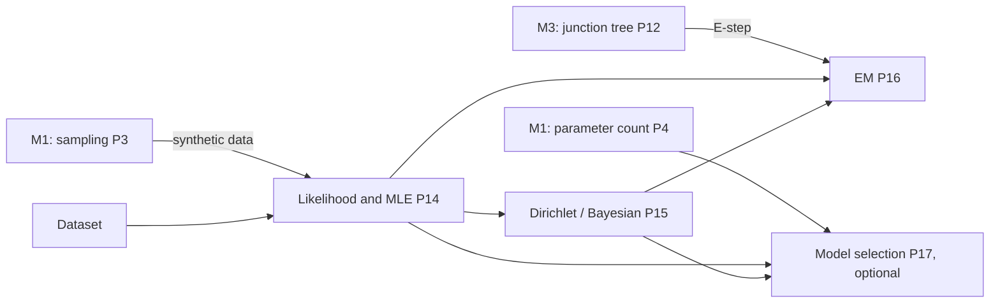

# ProbGraph — Milestone 4 Technical Specification (v1.0)

**Milestone:** Learning from data: maximum likelihood, Bayesian estimation, and EM for missing data.
**Release target:** `v0.4.0`.
**Status:** Accepted 2026-10-09. All §9 decisions are confirmed with their proposed defaults.
**Primary objective:** Learn the parameters of a Bayesian network from data, whether complete or
with missing values. Prove each estimator correct, and check it against independent oracles
(exact arithmetic, brute-force enumeration, and data sampled from a known network) so that
learning provably recovers what generated the data.

---

## 1. What we are building

Milestones 1–3 *used* a model whose parameters were given. Milestone 4 **finds** them. It closes
the loop: sample data from a known network with M1's sampler, learn the parameters back, and test
statistically that they converge to the truth.

1. **Data.** A `Dataset` of discrete observations, validated against the variables. Missing
   values are explicit (`None`).
2. **Likelihood and maximum likelihood.** The log-likelihood **decomposes** over CPD families, so
   the maximum-likelihood estimate (MLE) is a ratio of counts, one family at a time:
   $\hat\theta_{x\mid u}=N(x,u)/N(u)$.
3. **Bayesian estimation.** Dirichlet priors are conjugate, so the posterior is again Dirichlet,
   with pseudocounts $\alpha+N$. This gives smoothing, and it handles unseen parent configurations
   that make the MLE undefined. The **marginal likelihood** has a closed form, and it is the
   Bayesian score of a structure.
4. **EM for missing data.** The E-step computes **expected counts**, using M3's `JunctionTree` to
   get each family's posterior for each data row. The M-step is the MLE (or posterior mean) of
   those counts. Each iteration provably never decreases the observed-data likelihood.

An **optional** final task adds **model selection**: BIC and the Bayesian score, their
decomposability, and score equivalence. It reuses `n_free_parameters` from M1's P4.

### Mathematical dependency map



## 2. Scope

| Included in Milestone 4 | Deferred |
|---|---|
| A `Dataset` with explicit missing values; validation; sufficient statistics | Streaming / online learning |
| Log-likelihood (complete and observed-data) | Markov network parameter learning (no closed form) |
| MLE for Bayesian network CPDs | Structure *search* (hill climbing) beyond the optional task |
| Dirichlet priors (uniform $\alpha$, BDeu, explicit pseudocounts); posterior mean and MAP | Non-conjugate priors |
| Closed-form marginal likelihood (Bayesian score) | Hidden-structure discovery |
| EM under **missing at random (MAR)** | Missing *not* at random (MNAR) |
| *(optional)* BIC and Bayesian-score model selection, score equivalence | Causal discovery |

### Non-negotiable requirements (carried over)

- No probabilistic-programming or graphical-model library. NumPy only for arrays and arithmetic;
  `math.lgamma` for log-gamma.
- Every algorithm has a written proof in `docs/mathematics/` before it is implemented.
- Results are checked against **independent oracles**: exact fractions, brute-force
  enumeration, and recovery of a known generating model within proven statistical bounds.
- Each unit deliberately breaks its own code to confirm the tests notice ("mutation checks").
  Surviving mutants are explained.
- Strict mypy under both Python 3.11/NumPy 2.4 and 3.12. No Claude attribution in commits.

---

## 3. Interfaces and mathematical contracts

### 3.1 `Dataset`

```python
class Dataset:
    def __init__(self, variables: Sequence[DiscreteVariable],
                 rows: Iterable[Mapping[str, str | None]]) -> None: ...
    @classmethod
    def from_samples(cls, model: BayesianNetwork, samples: Iterable[Mapping[str, str]]) -> Dataset: ...
    variables: tuple[DiscreteVariable, ...]
    n_rows: int
    is_complete: bool
    def counts(self, names: Sequence[str]) -> DiscreteFactor: ...   # rows where all of `names` are observed
    def rows(self) -> Iterator[dict[str, str | None]]: ...
    def with_missing(self, fraction: float, seed: int, variables=None) -> Dataset: ...  # MCAR masking, for tests and experiments
```

| ID | Statement |
|---|---|
| D1 | Every observed value is a valid state of its variable. Unknown variables, and rows that omit a variable, are rejected. |
| D2 | `None` is the only representation of "missing". |
| D3 | A dataset is immutable after construction. |
| D4 | `counts(names)` sums to the number of rows in which every name is observed. |

### 3.2 Likelihood and maximum likelihood

```python
def log_likelihood(model: BayesianNetwork, data: Dataset) -> float: ...   # observed-data; -inf if some row is impossible
def maximum_likelihood(structure: BayesianNetwork, data: Dataset,
                       unseen: Literal["raise", "uniform"] = "raise") -> BayesianNetwork: ...
```

`structure` is a `BayesianNetwork` whose graph is used. Its CPDs, if any, are ignored, and a new
model is returned.

| ID | Statement |
|---|---|
| L1 | **Decomposition:** for complete data, $\log L(\theta)=\sum_i\sum_{x,u}N(x_i,u_i)\log\theta_{x_i\mid u_i}$, equal to brute force $\sum_m\log P(x^{(m)})$. |
| L2 | **The closed form:** $\hat\theta_{x\mid u}=N(x,u)/N(u)$ for every family and every observed parent configuration. |
| L3 | **Optimality:** perturbing any CPD of $\hat\theta$ while keeping it valid never increases $\log L$. |
| L4 | **Unseen parent configurations** ($N(u)=0$) raise by default, naming them. `unseen="uniform"` is an explicit opt-in. |
| L5 | **Consistency:** on data sampled from a known network, every $\hat\theta_{x\mid u}$ lies within M1's Bernstein tolerance of the truth, with the bound conditional on $N(u)$. |
| L6 | `maximum_likelihood` requires complete data, and points to EM otherwise. |

### 3.3 Bayesian estimation (Dirichlet)

```python
class DirichletPrior:
    @classmethod
    def uniform(cls, alpha: float = 1.0) -> DirichletPrior: ...        # alpha per cell (K2 when 1)
    @classmethod
    def bdeu(cls, equivalent_sample_size: float) -> DirichletPrior: ...  # alpha = ess / (|X| · |U|)
    @classmethod
    def explicit(cls, pseudocounts: Mapping[str, ArrayLike]) -> DirichletPrior: ...

def bayesian_estimate(structure, data, prior, point: Literal["mean", "map"] = "mean") -> BayesianNetwork: ...
def log_marginal_likelihood(structure, data, prior) -> float: ...   # the Bayesian score
```

| ID | Statement |
|---|---|
| B1 | **Conjugacy:** the posterior over each CPD column is $\mathrm{Dir}(\alpha_{\cdot\mid u}+N(\cdot,u))$. |
| B2 | Posterior mean $=(N(x,u)+\alpha_{x\mid u})/(N(u)+\alpha_{\cdot\mid u})$. MAP $=(N+\alpha-1)/(N(u)+\alpha_{\cdot\mid u}-|X|)$, valid only when every $\alpha\ge1$; otherwise it is rejected. |
| B3 | As $\alpha\to0$, the posterior mean tends to the MLE wherever $N(u)>0$. |
| B4 | **Marginal likelihood** $=\prod_{i,u}\frac{\Gamma(\alpha_{\cdot\mid u})}{\Gamma(\alpha_{\cdot\mid u}+N(u))}\prod_x\frac{\Gamma(\alpha_{x\mid u}+N(x,u))}{\Gamma(\alpha_{x\mid u})}$. It equals the product of **sequential posterior predictives** $\prod_mP(x^{(m)}\mid x^{(1..m-1)})$ (an independent oracle). |
| B5 | **Score equivalence:** BDeu gives Markov-equivalent structures the same marginal likelihood (for example $R\to T$ and $T\to R$), while K2 ($\alpha=1$ per cell) in general does **not**. This is tested on the asymmetric fixture F5, not on F1. |

### 3.4 Expectation–maximisation

```python
class ExpectationMaximisation:
    def __init__(self, structure: BayesianNetwork, data: Dataset,
                 prior: DirichletPrior | None = None,
                 max_iterations: int = 200, tolerance: float = 1e-8) -> None: ...
    def run(self, initial: BayesianNetwork | None = None, seed: int | None = None) -> EMResult: ...

@dataclass(frozen=True)
class EMResult:
    model: BayesianNetwork
    log_likelihood: tuple[float, ...]   # observed-data log L after every iteration
    converged: bool
    iterations: int
```

**E-step:** for each row, condition the current model on the row's observed values, and add the
posterior of each family $\{X_i\}\cup\mathrm{pa}_i$ to that family's expected counts. Every family
lies inside one clique of the junction tree (M3 J6), so `JunctionTree.query(family)` is exactly
the right call. Rows with identical observed values share one calibration.
**M-step:** the MLE, or with a prior the posterior mean or MAP, of the expected counts.

| ID | Statement |
|---|---|
| M1 | The expected counts equal the brute-force posterior expectation over every completion of each row. |
| M2 | **Monotonicity:** the observed-data log-likelihood never decreases between iterations (to within $10^{-10}$). With a prior, the log-posterior never decreases. |
| M3 | On complete data, EM reaches the MLE after one iteration and then stops. |
| M4 | The first iteration on fixture F3 gives the exact fractions in §4. |
| M5 | **Symmetric initialisation is a fixed point:** in a latent-class model, if every $P(F_j\mid C)$ is the same for all classes, EM never breaks the symmetry. Proved, and checked exactly. |
| M6 | **Recovery:** with values missing completely at random, EM's parameters on large samples lie close to the truth, closer than the MLE on the complete rows only. |
| M7 | It agrees with a brute-force EM implementation (enumerating every completion) on small random models. |

### 3.5 *(optional)* Model selection

```python
def bic(model: BayesianNetwork, data: Dataset) -> float: ...   # log L(θ̂) - (d/2) log N, with d = n_free_parameters
def score_structures(candidates, data, score: Literal["bic", "bdeu"], ...) -> list[tuple[float, BayesianNetwork]]: ...
```

| ID | Statement |
|---|---|
| S1 | $\mathrm{BIC}=\log L(\hat\theta)-\frac d2\log N$, with $d$ from M1's P4. |
| S2 | **Decomposability:** both scores are sums of per-family terms. Changing one edge changes only the terms of the affected child. |
| S3 | For large $N$ sampled from a known network, the true structure (or a Markov-equivalent one) scores best among a candidate set that includes supersets and subsets. |
| S4 | BDeu is score-equivalent (B5). BIC is too, for Markov-equivalent structures with equal parameter counts. |

---

## 4. Mathematical test fixtures

All values below were computed with exact rational arithmetic, or with v0.3.0, during planning.

**F1: a hand dataset (complete).** Rain → Traffic, 10 rows: (yes, yes) × 3, (yes, no) × 1,
(no, yes) × 1, (no, no) × 5.

| Quantity | Exact | Decimal |
|---|---|---|
| MLE $P(R{=}\text{yes})$ | $2/5$ | 0.4 |
| MLE $P(T{=}\text{yes}\mid R{=}\text{yes})$ | $3/4$ | 0.75 |
| MLE $P(T{=}\text{yes}\mid R{=}\text{no})$ | $1/6$ | 0.166667 |
| $\log L(\hat\theta)$ | $4\log\frac25+6\log\frac35+3\log\frac34+\log\frac14+\log\frac16+5\log\frac56$ | −11.682825 |
| Laplace ($\alpha=1$) posterior means | $5/12$, $2/3$, $1/4$ | |
| BIC, $R\to T$ ($d=3$) | | −15.136702 |
| BIC, $R$ and $T$ independent ($d=2$) | | −15.762818 (worse: the dependence is worth its parameter) |

**F2: synthetic recovery.** Sample $N$ rows from the M2 Late network with
`AncestralSampler(seed=2026)` and learn every CPD by MLE:

| $N$ | max $\lvert\hat\theta-\theta\rvert$ | smallest $N(u)$ |
|---|---|---|
| 1,000 | 0.0481 | 32 |
| 10,000 | 0.0108 | 259 |
| 100,000 | 0.0052 | 2,999 |

The worst error is driven by the rarest parent configuration, (Rain = yes, Accident = yes), with
probability 0.03. It shrinks like $1/\sqrt{N(u)}$, and the tests use M1's Bernstein tolerance
conditional on $N(u)$.

**F3: one EM iteration by hand.** F1 plus two incomplete rows, (R = yes, T = ?) and (R = ?, T = yes),
starting from F1's MLE:

| Step | Value |
|---|---|
| E-step: $P(T{=}\text{yes}\mid R{=}\text{yes})$ | $3/4$ |
| E-step: $P(R{=}\text{yes}\mid T{=}\text{yes})$ | $3/4$ |
| M-step: $P(R{=}\text{yes})$ | $23/48\approx0.479167$ |
| M-step: $P(T{=}\text{yes}\mid R{=}\text{yes})$ | $18/23\approx0.782609$ |
| M-step: $P(T{=}\text{yes}\mid R{=}\text{no})$ | $1/5$ |
| Observed-data $\log L$ | −13.515406 → **−13.314771** (increases, as M2 requires) |

**F4: the latent-class trap.** Naive Bayes with a hidden class $C$, and every $P(F_j\mid C=0)$
equal to $P(F_j\mid C=1)$ at initialisation. Then every row's posterior over $C$ equals the prior,
the M-step reproduces the same symmetric parameters, and EM is stuck at a saddle-like fixed point
whatever the data say. Random initialisation escapes it. This demonstrates M5, and that EM finds
**local** optima.

**F5: score equivalence needs asymmetric data.** F1's two variables have identical margins
(each is "yes" in 4 of 10 rows), so $R\to T$ and $T\to R$ produce the same counts, and any score
would tie on it. A test of B5 on F1 would prove nothing. F5 uses 10 rows with (yes, yes) × 5,
(yes, no) × 1, (no, yes) × 2, (no, no) × 2, so $R$ is "yes" 6 times and $T$ is "yes" 7 times.

| Prior | $\log P(D\mid R\to T)$ | $\log P(D\mid T\to R)$ |
|---|---|---|
| BDeu, ess = 1 | −16.5436551681 | −16.5436551681 (**equal**) |
| K2, $\alpha=1$ per cell | −14.8838698035 | −14.7942576448 (**different**) |

---

## 5. Proofs required

| Proof | Content |
|---|---|
| **P14 Likelihood and MLE** | The likelihood factorises by P1. Decomposition into independent per-column problems. The closed form via Gibbs' inequality, $\sum p\log q\le\sum p\log p$. Why $N(u)=0$ leaves a column undetermined. Consistency by the strong law, and the finite-$N$ Bernstein bound conditional on $N(u)$. |
| **P15 Dirichlet estimation** | The Dirichlet density; conjugacy; global and local parameter independence; posterior mean and mode; the marginal likelihood as a ratio of normalising constants (gamma functions); its equality with sequential prediction (the chain rule); BDeu and score equivalence (stated, with a two-node proof). |
| **P16 EM** | Jensen's inequality and the lower bound $\log P(x_{\text{obs}})\ge\mathbb E_q[\log P(x_{\text{obs}},Z)]+H(q)$, tight at $q=P(Z\mid x_{\text{obs}})$. E-step = expected sufficient statistics; M-step = MLE of them. **Monotonicity theorem.** Fixed points are stationary points. The symmetric fixed point. The MAR assumption and why it lets the missingness mechanism be ignored. |
| **P17 Model selection** *(optional)* | BIC as a Laplace approximation (sketch); decomposability; consistency (stated). |

New files: `docs/mathematics/likelihood.md`, `dirichlet.md`, `em.md`, and `model_selection.md`
(optional).

---

## 6. Implementation sequence

| # | Task | Completion criterion |
|---|---|---|
| 1 | **`Dataset`**: validation, missing values, counts, MCAR masking | D1–D4 |
| 2 | **Log-likelihood and MLE** | L1–L4, L6; F1 exactly |
| 3 | **Statistical recovery** from sampled data | L5 on the Late network and random networks; F2 |
| 4 | **Dirichlet priors**: posterior mean/MAP, BDeu | B1–B3 |
| 5 | **Marginal likelihood** (the Bayesian score) | B4 (gamma closed form = sequential prediction), B5 |
| 6 | **EM**: E-step via `JunctionTree` (rows grouped), M-step, history | M1–M4; F3 exactly |
| 7 | **EM oracles and behaviour**: brute-force EM, latent class, MCAR recovery | M5–M7 |
| 8 | *(optional)* **Model selection**: BIC, scoring candidate structures | S1–S4 |
| 9 | **Package and document v0.4.0**: example, README, changelog, CI | Fresh-install CI passes |

---

## 7. Acceptance criteria for Milestone 4

- [ ] `Dataset` validates states, represents missing values only as `None`, and its counts are exact.
- [ ] The MLE matches F1 exactly, and no valid perturbation increases the likelihood.
- [ ] Learning from sampled data recovers the generating parameters within proven bounds.
- [ ] Dirichlet posterior means and MAP match their closed forms; $\alpha\to0$ recovers the MLE.
- [ ] The marginal likelihood's gamma formula equals the product of sequential predictives; BDeu is score-equivalent.
- [ ] EM's first iteration on F3 matches the exact fractions; the observed-data likelihood never decreases.
- [ ] EM agrees with brute-force EM on small models; the symmetric fixed point and its escape are demonstrated.
- [ ] Proofs P14–P16 (and P17 if task 8 is done) are documented.
- [ ] `v0.4.0` installs fresh and passes CI.

---

## 8. Repository additions

```
src/probgraph/learning/
├── __init__.py
├── dataset.py            # Dataset
├── likelihood.py         # log_likelihood, maximum_likelihood
├── dirichlet.py          # DirichletPrior, bayesian_estimate, log_marginal_likelihood
├── em.py                 # ExpectationMaximisation, EMResult
└── selection.py          # (task 8) bic, score_structures
tests/
├── test_dataset.py
├── test_likelihood.py
├── test_recovery.py
├── test_dirichlet.py
├── test_em.py
└── test_selection.py     # (task 8)
docs/mathematics/
├── likelihood.md
├── dirichlet.md
├── em.md
└── model_selection.md    # (task 8)
examples/
└── learning_traffic.py   # sample, learn back, smooth, EM with missing data
```

---

## 9. Decisions (accepted 2026-10-09)

| ⚑ | Decision | Accepted | Why |
|---|---|---|---|
| 1 | Data representation | **A `Dataset` of rows with `None` for missing values**, stored internally as integer index arrays (−1 for missing) | Validated once; fast counting; one explicit missing marker |
| 2 | MLE with unseen parent configurations | **Raise, naming them**; `unseen="uniform"` is an explicit opt-in | The MLE is genuinely undefined there; guessing silently is the M2 underflow lesson in another form. Dirichlet priors are the principled fix |
| 3 | Prior specification | **`uniform(alpha)`, `bdeu(ess)` and `explicit(...)`** | Covers K2/Laplace, the score-equivalent prior, and full control |
| 4 | Point estimate from the posterior | **The posterior mean by default**; MAP on request (only when every $\alpha\ge1$) | The mean is always defined for $\alpha>0$; the mode is not |
| 5 | E-step engine | **`JunctionTree` per distinct observed pattern** (rows grouped) | Exact, and log-space safe for long rows; reuses M3; grouping makes repeated patterns free |
| 6 | EM stopping rule | **Absolute change in observed-data $\log L$ below `tolerance`, or `max_iterations`**; the full history is reported | Honest, as in loopy BP; the history lets tests check monotonicity |
| 7 | Missingness assumption | **MAR, documented and assumed**; no MNAR | MAR is what makes ignoring the missingness mechanism valid (P16) |
| 8 | Include model selection (task 8)? | **Yes, last and cuttable** | Small, and reuses P4's parameter count |
| 9 | Learning Markov network parameters | **Deferred** | No closed form; it needs gradient methods with inference inside each step |

---

## 10. Where to begin

Start with **task 1** and **P14**. Before writing code, derive by hand why the complete-data
log-likelihood of a Bayesian network splits into one independent term per CPD column, and why
each term $\sum_xN(x,u)\log\theta_{x\mid u}$ is maximised at $\theta_{x\mid u}=N(x,u)/N(u)$ (Gibbs'
inequality). Then compute F1's MLE by hand. Those 10 rows become the first test.

**Next implementation unit:** `M4.1 — Dataset`, followed immediately by `M4.2 — log-likelihood and MLE`.

---

### Looking ahead (not committed)

Structure search (greedy hill climbing over DAGs, reusing `DAG`'s transactional edge
operations), Markov network parameter learning by gradient ascent with junction-tree inference,
MAP inference by max-product, and MCMC.
