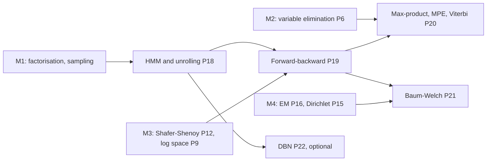

# ProbGraph — Milestone 5 Technical Specification (v1.3)

**Milestone:** Temporal models: hidden Markov models, forward–backward, max-product (Viterbi and
MPE), and Baum–Welch.
**Release target:** `v0.5.0`.
**Status:** Accepted 2026-10-09. All §9 decisions are confirmed with their proposed defaults.
**v1.1 (M5.3):** ⚑3 revised: both sweeps run the normalised recursion in log space. Searching extreme
models found linear (scaled) arithmetic wrong by up to 1.0 (forward_backward.md §4).
**v1.2 (M5.6):** W6 corrected: equal emission rows are a fixed point only when π is also stationary
for A (baum_welch.md Theorem 1); W1 accounts for M4 filling in counts for missing observations.
**v1.3 (M5.8):** the DBN interface is derived from the transition CPDs rather than passed in.
**Primary objective:** Model sequences with a hidden Markov chain. Compute filtered, smoothed and
predicted beliefs, the most probable hidden path, and the parameters from unlabelled sequences.
Prove that each algorithm is a known one from Milestones 2–4 specialised to a chain, and test it
against those general implementations, run on the unrolled network, as independent oracles.

---

## 1. What we are building

Milestones 1–4 handled one static network. Milestone 5 handles **time**: a hidden state $X_t$
evolves as a Markov chain, and each step emits an observation $Y_t$. Unrolled for $T$ steps, a
hidden Markov model (HMM) is just a Bayesian network whose moral graph is a chain of cliques.
So every algorithm here is an earlier one, made fast and numerically safe for long chains:

1. **Representation.** `HiddenMarkovModel(initial, transition, emission)`, homogeneous in time.
   It samples sequences, and `to_bayesian_network(T)` unrolls it into an M1 `BayesianNetwork`.
   That network is the **oracle** for everything below.
2. **Forward–backward** (sum-product on the chain). Filtering $P(X_t\mid y_{1:t})$, smoothing
   $P(X_t\mid y_{1:T})$, pairwise posteriors, prediction, and $\log P(y_{1:T})$, in $O(TK^2)$.
   The recursion is **normalised** at every step, so a sequence of 5,000 steps (where
   $P(y)\approx e^{-2070}$) works. It is Shafer–Shenoy (M3) on the chain's clique tree.
3. **Max-product.** Replacing sum by max gives the **most probable explanation (MPE)**. This works
   for general Bayesian networks via max-product variable elimination, and on an HMM it is the
   **Viterbi** algorithm. This fills the "MAP inference" gap left since M2. It also shows why the
   sequence of individually most probable states can be an *impossible* path.
4. **Baum–Welch** (EM, M4, with parameters tied across time). Expected transition and emission
   counts come from forward–backward. Each iteration provably does not decrease the likelihood.

An **optional** task generalises the HMM to **dynamic Bayesian networks** (2-TBNs) with unrolling.

### Mathematical dependency map



## 2. Scope

| Included in Milestone 5 | Deferred |
|---|---|
| Homogeneous discrete HMMs: one hidden and one observed variable per step | Continuous emissions (Gaussian HMMs), Kalman filters |
| Sampling sequences; unrolling to a `BayesianNetwork` | Hidden semi-Markov models (explicit durations) |
| Filtering, smoothing, pairwise posteriors, prediction, likelihood; missing observations | Online / streaming APIs, fixed-lag smoothing |
| Stationary distribution; convergence of prediction | Particle filtering |
| MPE by max-product VE on general Bayesian networks; Viterbi; posterior decoding | **Marginal** MAP (max over some variables, sum over others) |
| Baum–Welch for one or many sequences, with optional pseudocounts | Discriminative training; model order selection |
| *(optional)* 2-TBN dynamic Bayesian networks with unrolling | Exact DBN filtering by the interface algorithm |

### Non-negotiable requirements (carried over)

- No probabilistic-programming or graphical-model library. NumPy only for arrays and arithmetic.
- Every algorithm has a written proof in `docs/mathematics/` before it is implemented.
- Results are checked against **independent oracles**: exact fractions, brute-force enumeration
  over all hidden paths, and the general M2–M4 algorithms on the unrolled network.
- Each unit deliberately breaks its own code to confirm the tests notice ("mutation checks").
- Strict mypy under both Python 3.11/NumPy 2.4 and 3.12. No Claude attribution in commits.

---

## 3. Interfaces and mathematical contracts

### 3.1 The model

```python
class HiddenMarkovModel:
    def __init__(self, hidden: DiscreteVariable, observed: DiscreteVariable,
                 initial: ArrayLike,      # initial[i]     = P(X_1 = i)
                 transition: ArrayLike,   # transition[i,j] = P(X_{t+1} = j | X_t = i)
                 emission: ArrayLike,     # emission[i,m]   = P(Y_t = m | X_t = i)
                 ) -> None: ...
    def sample(self, length: int, seed: int | None = None) -> tuple[list[str], list[str]]: ...  # (states, observations)
    def to_bayesian_network(self, length: int) -> BayesianNetwork: ...  # variables X_1..X_T, Y_1..Y_T
    def stationary_distribution(self) -> np.ndarray: ...                # raises unless unique
    n_free_parameters: int                                             # (K-1) + K(K-1) + K(M-1)
```

Observation sequences are `Sequence[str | None]`; `None` is a missing observation (MAR, as in M4).

| ID | Statement |
|---|---|
| H1 | `initial`, every row of `transition`, and every row of `emission` lie on the simplex (M1's tolerance policy); shapes match the variables. Storage is read-only. |
| H2 | **Unrolling is exact:** the joint of `to_bayesian_network(T)` equals $\pi_{x_1}B_{x_1y_1}\prod_{t\ge2}A_{x_{t-1}x_t}B_{x_ty_t}$ for every assignment. |
| H3 | Sampling is ancestral sampling of the unrolled network: reproducible, and its frequencies pass M1's Bernstein tests. |
| H4 | The stationary distribution satisfies $\pi^\top A=\pi^\top$, $\sum\pi=1$. It is unique iff the chain has one closed communicating class; otherwise `stationary_distribution` raises. |

### 3.2 Forward–backward

```python
class ForwardBackward:
    def __init__(self, model: HiddenMarkovModel, observations: Sequence[str | None]) -> None: ...
    log_likelihood: float                 # log P(y_1:T); computed once, in O(T K^2)
    filtered: np.ndarray                  # (T, K): P(X_t | y_1:t)
    smoothed: np.ndarray                  # (T, K): P(X_t | y_1:T)
    pairwise: np.ndarray                  # (T-1, K, K): P(X_t, X_{t+1} | y_1:T)
    def predict(self, steps: int) -> np.ndarray: ...   # (steps, K): P(X_{T+k} | y_1:T), k = 1..steps
```

| ID | Statement |
|---|---|
| F1 | `filtered`, `smoothed`, `pairwise` and `log_likelihood` equal brute-force enumeration over all $K^T$ hidden paths (small $T$), and `JunctionTree` on the unrolled network (any $T$). |
| F2 | **Normalised recursion:** with $c_t=P(y_t\mid y_{1:t-1})$, $\log P(y_{1:T})=\sum_t\log c_t$. Nothing underflows: F4 (§4) matches exact rational arithmetic to $10^{-9}$ relative, where the unnormalised recursion returns 0 or sticks at the smallest subnormal $5\times10^{-324}$ (wrong by over 1,000 nats, silently). |
| F3 | Consistency: $\sum_j\xi_t(i,j)=\gamma_t(i)$, $\sum_i\xi_t(i,j)=\gamma_{t+1}(j)$, and the last smoothed belief equals the last filtered belief. |
| F4 | Missing observations contribute an emission factor of 1, and agree with the unrolled network with $Y_t$ unobserved. |
| F5 | **Prediction forgets:** for an irreducible aperiodic chain, `predict(k)` converges geometrically to the stationary distribution. For the umbrella chain the gap is exactly $0.4^k$ times the initial gap. |
| F6 | An impossible observation sequence gives `log_likelihood = -inf`, and the beliefs raise `ZeroProbabilityEvidenceError`. |

### 3.3 Max-product: MPE and Viterbi

```python
# probgraph.inference
class VariableElimination:
    def most_probable_explanation(self, evidence: Mapping[str, str] | None = None
                                  ) -> tuple[dict[str, str], float]: ...  # (argmax over every unobserved variable, log P(x, e))

# probgraph.temporal
def viterbi(model: HiddenMarkovModel, observations: Sequence[str | None]) -> tuple[list[str], float]: ...  # (path, log P(path, y))
def posterior_decode(model: HiddenMarkovModel, observations: Sequence[str | None]) -> list[str]: ...    # argmax_t of smoothed
```

| ID | Statement |
|---|---|
| V1 | **Max distributes over product** (for nonnegative factors), so max-product VE computes $\max_x P(x,e)$ exactly, for every elimination order. The proof is P6's with the sum replaced by max: both are commutative semirings. |
| V2 | MPE equals brute-force maximisation on random networks with random evidence. The returned assignment attains the returned value; when the maximiser is unique, it is returned. |
| V3 | **Viterbi = MPE of the unrolled network**, and equals brute force over all $K^T$ paths. Computed in log space (max-sum), so long sequences are fine. |
| V4 | **Posterior decoding is not MAP:** on fixture F2 the sequence of individually most probable states has probability **zero**. |
| V5 | Ties are broken deterministically (lowest state index at each backtracking step); tests check the value always, and the path only when the maximiser is unique. |

### 3.4 Baum–Welch

```python
class BaumWelch:
    def __init__(self, hidden: DiscreteVariable, observed: DiscreteVariable,
                 sequences: Sequence[Sequence[str | None]], pseudocount: float = 0.0,
                 max_iterations: int = 200, tolerance: float = 1e-8) -> None: ...
    def run(self, initial: HiddenMarkovModel | None = None, seed: int | None = None) -> BaumWelchResult: ...
    def step(self, model: HiddenMarkovModel) -> HiddenMarkovModel: ...

@dataclass(frozen=True)
class BaumWelchResult:
    model: HiddenMarkovModel
    log_likelihood: tuple[float, ...]   # entry 0 initial; entry t after iteration t (as M4)
    log_objective: tuple[float, ...]    # what never decreases (with pseudocounts: the shifted log-posterior, em.md §7)
    converged: bool
    iterations: int
```

| ID | Statement |
|---|---|
| W1 | Expected counts ($\sum_t\gamma_t$, $\sum_t\xi_t$, and emissions) equal brute force over all paths, **and** equal M4's `expected_counts` on the unrolled network summed over the tied families (for emissions, minus M4's filled-in counts $\gamma_t(i)B_{im}$ at missing observations: both are valid EM, with the same fixed points). That second oracle is entirely independent code. |
| W2 | One iteration on fixture F3 gives the exact fractions in §4. |
| W3 | **Monotonicity:** `log_objective` never decreases (to $10^{-10}$); this is P16's theorem with tied parameters. |
| W4 | With hidden states observed, the estimate is the transition/emission count ratios (the M4 MLE). |
| W5 | **Recovery:** from long sequences sampled from a known HMM, the estimate is close to the truth **up to a relabelling of the hidden states**, and the likelihood is at least that of the truth. |
| W6 | A symmetric initialisation (all rows of the emission matrix equal, **and** $\pi$ stationary for $A$) reaches a fixed point in one iteration, with every emission row equal to the observed symbol frequencies. Without stationarity the rows separate. |

### 3.5 *(optional)* Dynamic Bayesian networks

```python
def previous(variable: DiscreteVariable) -> DiscreteVariable: ...   # the copy "X[t-1]", a transition-CPD parent

class DynamicBayesianNetwork:
    def __init__(self, initial: BayesianNetwork, transition: Sequence[TabularCPD]) -> None: ...  # a 2-TBN
    @classmethod
    def from_hmm(cls, model: HiddenMarkovModel) -> DynamicBayesianNetwork: ...
    interface: tuple[str, ...]          # derived: template variables with a child in the next slice
    def unroll(self, length: int) -> BayesianNetwork: ...
```

| ID | Statement |
|---|---|
| N1 | Unrolling an HMM written as a 2-TBN gives the same network as `HiddenMarkovModel.to_bayesian_network`. |
| N2 | Unrolled inference via `JunctionTree` matches brute force; the clique sizes grow with the interface, not with $T$. |

---

## 4. Mathematical test fixtures

All values below were computed with exact rational arithmetic during planning.

**F1: the umbrella world** (Russell & Norvig §14.2). $X_t\in\{\text{rain},\text{dry}\}$,
$Y_t\in\{\text{umbrella},\text{none}\}$, $\pi=(1/2,1/2)$, $A=\begin{pmatrix}0.7&0.3\\0.3&0.7\end{pmatrix}$,
$B=\begin{pmatrix}0.9&0.1\\0.2&0.8\end{pmatrix}$.

| Quantity | Exact | Decimal |
|---|---|---|
| Filtered $P(\text{rain}_1\mid u_1)$ | $9/11$ | 0.818182 |
| Filtered $P(\text{rain}_2\mid u_1,u_2)$ | $621/703$ | 0.883357 |
| Smoothed $P(\text{rain}_1\mid u_1,u_2)$ | $621/703$ | 0.883357 (the same, by the chain's symmetry) |
| $P(u_1,u_2)$ | $703/2000$ | $\log=-1.045546$ |
| $y=(u,u,\neg u,u,u)$: $P(y)$ | $68607401/2000000000$ | $\log=-3.372502$ |
| Viterbi path for $y$ | (rain, rain, dry, rain, rain) | $P(\text{path}\mid y)=0.337386$ |
| Smoothed $P(\text{rain}_t\mid y)$, $t=1..5$ | | 0.867339, 0.820419, 0.307484, 0.820419, 0.867339 |
| Prediction $P(\text{rain}_{2+k}\mid u_1,u_2)$ | $\frac12+0.4^k\big(\frac{621}{703}-\frac12\big)$ | 0.653343, 0.561337, 0.524535 for $k=1,2,3$ |

**F2: posterior decoding can be impossible.** Three states, $\pi=(2/5,3/10,3/10)$; state 0 always
moves to 1, and states 1 and 2 always move to 2; emissions are uninformative. For $T=2$:
marginals are $(2/5,3/10,3/10)$ and $(0,2/5,3/5)$, so posterior decoding gives $(0,2)$, a path of
probability **0**. Viterbi gives $(0,1)$ with probability $2/5$.

**F3: one Baum–Welch iteration by hand.** From F1's parameters on $y=(u,u,\neg u,u,u)$:

| Parameter | Exact | Decimal |
|---|---|---|
| $\pi'(\text{rain})$ | $59505867/68607401$ | 0.867339 |
| $A'(\text{rain}\to\text{rain})$ | $7928676/10731953$ | 0.738792 |
| $A'(\text{dry}\to\text{rain})$ | $25229493/40627225$ | 0.621000 |
| $B'(\text{umbrella}\mid\text{rain})$ | $25731708/28075669$ | 0.916513 |
| $B'(\text{umbrella}\mid\text{dry})$ | $5355529/11294498$ | 0.474171 |
| $\log P(y)$ | | −3.372502 → **−2.458385** |

**F4: underflow.** F1's model with $T$ umbrellas in a row: $\log P(y)=-414.0917995185$ for
$T=1000$ and $-2069.560503770881$ for $T=5000$; alternating umbrella/none for $T=1000$ gives
$-868.4784295542072$. The last two are far below float64's smallest positive number
($\approx e^{-745}$). The unnormalised recursion returns 0 for the alternating sequence, and for
5,000 umbrellas gets stuck at the smallest subnormal $5\times10^{-324}$ ($\log\approx-744.4$).

**F5: MPE on the late network** (M2). With no evidence the MPE is "nothing happens"
(all "no"), $P=0.45927$. Given Late = yes, it is (Rain = yes, Accident = no, Traffic = yes,
Umbrella = yes) with $P(x,e)=0.11016$; the runner-up has $0.05103$.

---

## 5. Proofs required

| Proof | Content |
|---|---|
| **P18 Markov chains and HMMs** | The HMM as an unrolled Bayesian network (P1); conditional independences (the future is independent of the past given the present); the stationary distribution, uniqueness for one closed class, and geometric convergence for irreducible aperiodic chains (the two-state case exactly; the general case via Perron–Frobenius, stated). |
| **P19 Forward–backward** | The filtering and backward recursions from the factorisation; the normalised recursion and $\log P(y)=\sum\log c_t$; smoothing as $\alpha\beta$; pairwise posteriors; equivalence with Shafer–Shenoy on the chain's clique tree; cost $O(TK^2)$; missing observations. |
| **P20 Max-product** | Semirings: $(\max,\times)$ like $(+,\times)$ satisfies the distributive law, so P6 carries over; max-product VE and backtracking (traceback) correctness; Viterbi as its chain special case; log space (max-sum); why posterior decoding differs from MAP. |
| **P21 Baum–Welch** | EM (P16) with parameters tied across time; expected counts from forward–backward; the M-step as count ratios; monotonicity; label switching and the symmetric fixed point; many sequences. |
| **P22 DBNs** *(optional)* | 2-TBNs; unrolling; why exact inference costs grow with the interface (entanglement). |

New files: `docs/mathematics/markov_chains.md`, `forward_backward.md`, `max_product.md`,
`baum_welch.md`, and `dbn.md` (optional).

---

## 6. Implementation sequence

| # | Task | Completion criterion |
|---|---|---|
| 1 | **`HiddenMarkovModel`**: validation, sampling, unrolling, stationary distribution | H1–H4 |
| 2 | **Forward pass**: filtering, normalised likelihood, missing observations | F1 (filtering, likelihood), F2, F4, F6; F1 and F4 fixtures exactly |
| 3 | **Backward pass**: smoothing, pairwise posteriors, prediction | F1, F3, F5 |
| 4 | **Max-product VE**: MPE on general Bayesian networks | V1, V2; F5 fixture |
| 5 | **Viterbi and posterior decoding** | V3–V5; F1 Viterbi and F2 exactly |
| 6 | **Baum–Welch**: expected counts, M-step, history | W1–W4; F3 exactly |
| 7 | **Baum–Welch behaviour**: recovery up to relabelling, many sequences, symmetric fixed point | W5, W6 |
| 8 | *(optional)* **Dynamic Bayesian networks** | N1, N2 |
| 9 | **Package and document v0.5.0**: example, README, changelog, CI | Fresh-install CI passes |

---

## 7. Acceptance criteria for Milestone 5

- [x] Unrolling is exact, and sampled sequences pass statistical tests.
- [x] Filtering, smoothing, pairwise posteriors and the likelihood match brute force and the junction tree on the unrolled network.
- [x] 5,000-step sequences give the exact log-likelihood where the unnormalised recursion underflows (to 0, or to a stuck subnormal).
- [x] Prediction converges to the stationary distribution at the proven rate.
- [x] Max-product VE finds the MPE on random networks; Viterbi equals the unrolled MPE and brute force.
- [x] Posterior decoding is shown to produce an impossible path where Viterbi does not.
- [x] One Baum–Welch iteration on F3 matches the exact fractions; the objective never decreases; expected counts match M4's EM on the unrolled network.
- [x] Proofs P18–P21 (and P22 if task 8 is done) are documented.
- [ ] `v0.5.0` installs fresh and passes CI. *(Ticked when the tagged commit's CI run passes.)*

---

## 8. Repository additions

```
src/probgraph/temporal/
├── __init__.py
├── hmm.py                # HiddenMarkovModel
├── forward_backward.py   # ForwardBackward
├── viterbi.py            # viterbi, posterior_decode
├── baum_welch.py         # BaumWelch, BaumWelchResult
└── dbn.py                # (task 8) DynamicBayesianNetwork
src/probgraph/inference/variable_elimination.py   # + most_probable_explanation
tests/
├── test_hmm.py
├── test_forward_backward.py
├── test_max_product.py
├── test_viterbi.py
├── test_baum_welch.py
├── test_baum_welch_oracles.py
└── test_dbn.py           # (task 8)
docs/mathematics/
├── markov_chains.md
├── forward_backward.md
├── max_product.md
├── baum_welch.md
└── dbn.md                # (task 8)
examples/
└── umbrella_world.py     # filter, smooth, predict, decode, and learn the umbrella world back
```

---

## 9. Decisions (accepted 2026-10-09)

| ⚑ | Decision | Accepted | Why |
|---|---|---|---|
| 1 | Model class | **A dedicated homogeneous `HiddenMarkovModel`** (one hidden, one observed variable), with `to_bayesian_network` as the bridge; general DBNs only in optional task 8 | Fast $O(TK^2)$ algorithms need the chain structure; the unrolled network keeps every M1–M4 tool available as an oracle |
| 2 | Inference API | **An engine computed once, `ForwardBackward(model, observations)`**, plus functions `viterbi` and `posterior_decode` | Matches `JunctionTree(model, evidence)`; one pass serves every query |
| 3 | Numerics | **Normalised forward–backward carried in log space** (log-sum-exp), with $\log P(y)=\sum\log c_t$; Viterbi in log space (max-sum). *(v1.1: originally linear scaling, which is cheaper but was found wrong by up to 1.0 on extreme models.)* | Every representable probability survives as a logarithm; products cannot flush a later-decisive state to 0 |
| 4 | Missing observations | **`None` gives an emission factor of 1** | Same MAR semantics as M4; matches the unrolled network with $Y_t$ unobserved |
| 5 | Conventions | **`initial` is $P(X_1)$; `transition[i, j]` $=P(X_{t+1}=j\mid X_t=i)$ (rows sum to 1)** | The standard HMM convention; R&N's $P(X_0)$ form is one prediction step away |
| 6 | MAP scope | **MPE (max over all unobserved variables) by max-product VE**, plus Viterbi; marginal MAP deferred | MPE has the same complexity as VE; marginal MAP needs constrained orders and is NP^PP-hard |
| 7 | Ties | **Any maximiser is correct; the choice is deterministic** (lowest index while backtracking) | Optimality is the contract; tests check paths only when unique |
| 8 | Baum–Welch prior | **An additive `pseudocount` (posterior-mean M-step), default 0**, objective as M4's `log_objective` | Prevents zero rows from short sequences; reuses the M4 analysis |
| 9 | Include DBNs (task 8)? | **Yes, last and cuttable** | Small given unrolling; shows where exact inference stops scaling |

---

## 10. Where to begin

Start with **task 1** and **P18**. Before writing code, write the umbrella world as an unrolled
Bayesian network for $T=2$ by hand and compute $P(\text{rain}_2\mid u_1,u_2)=621/703$ by
enumeration. Then derive the forward recursion from the factorisation, and check that it gives
$9/11$ and then $621/703$.
