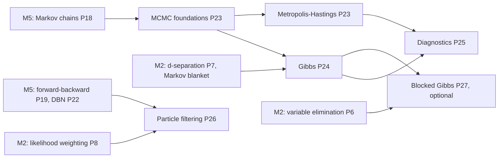

# ProbGraph — Milestone 6 Technical Specification (v1.0)

**Milestone:** Approximate inference by sampling: Markov chain Monte Carlo and particle filtering.
**Release target:** `v0.6.0`.
**Status:** Accepted 2026-10-10. All §9 decisions are confirmed with their proposed defaults.
**Primary objective:** Estimate posteriors by simulation when exact inference is too expensive.
Prove that each sampler targets the right distribution, measure how fast it gets there, and test
every estimate against the exact answers of Milestones 2–5. Use **exact transition matrices** of the
samplers on small models as oracles, so that the behaviour itself, not only the sampled outcome, is
checked.

---

## 1. What we are building

Milestones 2–5 compute exact answers, at a cost that grows with the width of the model (M2), and
for DBNs exponentially with the interface (M5, entanglement). Milestone 6 trades exactness for
cost that grows only linearly with the model, plus statistical error that shrinks like
$1/\sqrt{\text{effective samples}}$.

1. **Gibbs sampling.** Resample one variable at a time from its full conditional, which depends
   only on its **Markov blanket**. This works for Bayesian and Markov networks, with evidence clamped.
2. **Metropolis–Hastings.** Propose a change and accept it with probability
   $\min(1,\text{ratio})$. **Detailed balance** makes the target stationary. Gibbs is the special case
   that always accepts.
3. **Diagnostics.** Autocorrelation, integrated autocorrelation time, effective sample size (ESS),
   Monte Carlo standard error, and split-$\hat R$ across chains. These turn "the chain looks fine" into
   numbers, and the tests show when they are fooled, and when they are not.
4. **Particle filtering.** Sequential importance sampling with resampling, for HMMs and DBNs. It gives
   filtered beliefs, and an **unbiased** estimate of $P(y_{1:T})$, at a cost linear in the number of
   chains: the answer to M5's entanglement.

An **optional** task adds **blocked Gibbs**, which samples groups of strongly coupled variables
jointly and repairs the failures that the diagnostics expose.

### Mathematical dependency map



## 2. Scope

| Included in Milestone 6 | Deferred |
|---|---|
| Gibbs sampling (systematic and random scan) for Bayesian and Markov networks, with evidence | Hamiltonian Monte Carlo, continuous variables |
| Single-site Metropolis–Hastings | Adaptive MCMC, parallel tempering, simulated annealing |
| Autocorrelation, integrated autocorrelation time, ESS, MCSE, split-$\hat R$ | Rank-normalised $\hat R$, bulk/tail ESS |
| Particle filtering (bootstrap proposal) for HMMs and DBNs; multinomial, systematic and adaptive resampling; the likelihood estimator | Particle smoothing, auxiliary and optimal proposals, particle MCMC |
| *(optional)* Blocked Gibbs with exact block conditionals | Swendsen–Wang and other cluster algorithms |

### Non-negotiable requirements (carried over)

- No probabilistic-programming or graphical-model library. NumPy only for arrays, arithmetic and
  random numbers.
- Every algorithm has a written proof in `docs/mathematics/` before it is implemented.
- Statistical tests have stated tolerances with stated failure probabilities, fixed seeds, and
  deterministic outcomes. Wherever possible the tolerance uses an **exact** variance, computed from
  the sampler's transition matrix, rather than a variance estimated from the same samples.
- Each unit deliberately breaks its own code to confirm the tests notice ("mutation checks").
- Strict mypy under both Python 3.11/NumPy 2.4 and 3.12. No Claude attribution in commits.

---

## 3. Interfaces and mathematical contracts

### 3.1 Chains and the Gibbs sampler

```python
# probgraph.mcmc
@dataclass(frozen=True)
class Chain:
    variables: tuple[DiscreteVariable, ...]     # the unobserved variables, in model order
    states: np.ndarray                          # (n, d) state indices, read-only
    acceptance_rate: float                      # 1.0 for Gibbs
    def indicator(self, variable: str, state: str) -> np.ndarray: ...   # (n,) of 0/1
    def estimate(self, variables: Sequence[str]) -> DiscreteFactor: ...  # empirical joint of the samples

class GibbsSampler:
    def __init__(self, model: BayesianNetwork | MarkovNetwork, evidence: Mapping[str, str] | None = None,
                 scan: Literal["systematic", "random"] = "systematic", seed: int | None = None) -> None: ...
    def run(self, n_samples: int, burn_in: int = 0, thin: int = 1,
            initial: Mapping[str, str] | None = None) -> Chain: ...
    def full_conditional(self, variable: str, state: Mapping[str, str]) -> np.ndarray: ...  # P(X | rest)
```

| ID | Statement |
|---|---|
| G1 | **Local computation:** `full_conditional(X, x)` equals $P(X\mid x_{-X},e)$ computed from the full joint, and depends only on the Markov blanket of $X$. For a BN it is $\propto P(X\mid\mathrm{pa})\prod_{C\in\mathrm{ch}(X)}P(C\mid\mathrm{pa}_C)$; for an MN, the product of the factors containing $X$. |
| G2 | **Stationarity:** the exact transition matrix of one sweep (systematic) or one step (random scan), built in the tests from `full_conditional`, satisfies $\pi K=\pi$ with $\pi=P(\cdot\mid e)$. |
| G3 | **Consistency:** estimates are within $Z\sqrt{\sigma^2_{\text{asym}}/n}$ of the exact posterior, with $\sigma^2_{\text{asym}}$ computed exactly from the kernel (small models), on BNs and MNs, with evidence. |
| G4 | Evidence variables never change; a run is reproducible from its seed; `burn_in` and `thin` drop exactly the stated samples. |
| G5 | **Reducibility:** with deterministic CPDs (fixture F3) the chain cannot move between some states; the sampler does not hide this. Initialisation raises if no state with $P(x,e)>0$ is found. |

### 3.2 Metropolis–Hastings

```python
class MetropolisHastings:   # single-site: pick a variable, propose a different state uniformly
    def __init__(self, model, evidence=None, scan: Literal["systematic", "random"] = "random",
                 seed: int | None = None) -> None: ...
    def run(self, n_samples: int, burn_in: int = 0, thin: int = 1, initial=None) -> Chain: ...
```

| ID | Statement |
|---|---|
| H1 | **Detailed balance:** the exact kernel satisfies $\pi(x)K(x,x')=\pi(x')K(x',x)$, hence $\pi K=\pi$. |
| H2 | The acceptance probability is $\min\big(1,\pi(x')/\pi(x)\big)$ for this symmetric proposal, computed from the Markov blanket only. |
| H3 | **Peskun (fixture F4):** on binary variables, single-site MH (always propose the other state) has asymptotic variance no larger than random-scan Gibbs, for every function. Checked exactly from the kernels. |

### 3.3 Diagnostics

```python
def autocorrelation(x: ArrayLike, max_lag: int) -> np.ndarray: ...
def integrated_autocorrelation_time(x: ArrayLike) -> float: ...   # τ = 1 + 2 Σ ρ_k, Geyer's initial monotone sequence
def effective_sample_size(x: ArrayLike) -> float: ...             # n / τ
def monte_carlo_standard_error(x: ArrayLike) -> float: ...        # sqrt(var / ESS)
def split_r_hat(chains: Sequence[ArrayLike]) -> float: ...        # Gelman–Rubin on split halves
```

| ID | Statement |
|---|---|
| D1 | On a two-state Markov chain with second eigenvalue $\lambda$ (fixture F6), $\rho_k\to\lambda^k$, $\tau\to\frac{1+\lambda}{1-\lambda}$ and ESS $\to n\frac{1-\lambda}{1+\lambda}$, within stated tolerances. |
| D2 | For independent draws, $\tau\approx1$ and ESS $\approx n$. |
| D3 | The MCSE is calibrated: over many replicate chains, $|\hat\mu-\mu|\le2\cdot\mathrm{MCSE}$ about 95% of the time. |
| D4 | $\hat R\approx1$ for chains that mix; $\hat R>1.1$ for the near-deterministic F2 with overdispersed starts; $\hat R=\infty$ (reported as `inf`) when chains are stuck in different states (F3). A **single** chain can look converged when it is not; the tests show it. |

### 3.4 Particle filtering

```python
# probgraph.temporal
class ParticleFilter:
    def __init__(self, model: DynamicBayesianNetwork, evidence: Sequence[Mapping[str, str]],
                 n_particles: int, resampling: Literal["systematic", "multinomial", "adaptive", "none"] = "systematic",
                 seed: int | None = None) -> None: ...
    @classmethod
    def for_hmm(cls, model: HiddenMarkovModel, observations: Sequence[str | None], n_particles: int, **kwargs) -> ParticleFilter: ...
    def filtered(self, variable: str) -> np.ndarray: ...   # (T, |X|): weighted particle estimate of P(X_t | e_1:t)
    log_likelihood: float                                  # log of the unbiased estimator P̂(e_1:T)
    effective_sample_sizes: np.ndarray                     # (T,): ESS of the weights before resampling
```

| ID | Statement |
|---|---|
| P1 | **Unbiasedness:** $\mathbb E[\hat P(e_{1:T})]=P(e_{1:T})$ exactly, for every number of particles. Tested by the mean of $\hat P$ over many seeds against F5, within a CLT bound. |
| P2 | **Jensen:** $\mathbb E[\log\hat P]<\log P$, and the gap shrinks as $1/N$. |
| P3 | Filtered estimates converge to forward–backward's `filtered` at rate $1/\sqrt N$. |
| P4 | **Degeneracy:** without resampling, the ESS collapses towards 1 as $T$ grows; with resampling it does not. |
| P5 | Systematic resampling has no larger variance than multinomial for the number of offspring of each particle; both are unbiased: $\mathbb E[\text{offspring}_i]=Nw_i$. |
| P6 | **Entanglement, revisited:** on M5's factorial HMM, the particle filter's cost per step is linear in the number of chains, while the exact junction tree's largest clique grows with it; the particle estimate stays within its stated tolerance. |

### 3.5 *(optional)* Blocked Gibbs

```python
class BlockedGibbsSampler(GibbsSampler):
    def __init__(self, model, blocks: Sequence[Sequence[str]], evidence=None, seed=None) -> None: ...
```

| ID | Statement |
|---|---|
| B1 | Each block is drawn exactly from its joint conditional (via variable elimination on the block given its Markov blanket); the kernel is stationary. |
| B2 | On F2, blocking the coupled pair gives $\lambda_2=0$ for the pair: every sweep is an independent draw. On F3 it restores irreducibility. |

---

## 4. Mathematical test fixtures

All values below were computed with exact rational arithmetic during planning.

**F1: a two-node Gibbs chain.** $X\to Y$, both binary, $P(X{=}1)=3/10$,
$P(Y{=}1\mid X{=}0)=1/5$, $P(Y{=}1\mid X{=}1)=9/10$. The joint is $(14/25,\,7/50,\,3/100,\,27/100)$ over
$(x,y)=(0,0),(0,1),(1,0),(1,1)$, and $P(X{=}1\mid Y{=}1)=27/41$. The systematic-scan kernel (update $X$,
then $Y$) satisfies $\pi K=\pi$ exactly. After each sweep, $Y$ alone is a Markov chain with
$$K_Y=\begin{pmatrix}451/590&139/590\\139/410&271/410\end{pmatrix},\qquad\lambda_2=\frac{1029}{2419}\approx0.425382,\qquad\tau=\frac{1+\lambda_2}{1-\lambda_2}=\frac{1724}{695}\approx2.480576.$$

**F2: near-deterministic coupling.** $X$ uniform, $P(Y{=}X)=1-\varepsilon$. The systematic-scan $Y$-chain
has $\lambda_2=(1-2\varepsilon)^2$, so $\tau=\frac{1+\lambda_2}{1-\lambda_2}\approx\frac1{2\varepsilon}$:

| $\varepsilon$ | $\lambda_2$ | $\tau$ |
|---|---|---|
| 1/10 | 16/25 | 4.56 |
| 1/100 | 2401/2500 | 49.5 |
| 1/1000 | 249001/250000 | 499.5 |

**F3: determinism breaks Gibbs.** $Y=X$ exactly. From $(0,0)$ Gibbs never leaves $(0,0)$, and from
$(1,1)$ never leaves $(1,1)$: the chain is reducible, and each run reports a confident, wrong answer.
Two chains started apart give $\hat R=\infty$.

**F4: Peskun's ordering.** On F1 with random scan, the asymptotic variances $\sigma^2_{\text{asym}}$ are:

| Function | $\mathrm{Var}_\pi$ | random-scan Gibbs | single-site MH |
|---|---|---|---|
| $\mathbb 1[Y{=}1]$ | 0.2419 | 2.158305 | 1.644986 |
| $\mathbb 1[X{=}1]$ | 0.21 | 1.873683 | 1.344000 |

**F5: the particle likelihood.** The umbrella world (M5 F1): $P(u_1,u_2)=703/2000$ and
$P(u,u,\neg u,u,u)=68607401/2000000000$. The mean of $\hat P$ over seeds must match these, and the
mean of $\log\hat P$ must fall below $\log P$.

**F6: an autoregressive two-state chain.** A chain with $P(\text{stay})=p$ in both states has
$\lambda=2p-1$, $\rho_k=\lambda^k$ and $\tau=p/(1-p)$; for $p=0.9$, $\tau=9$ and ESS $=n/9$.

---

## 5. Proofs required

| Proof | Content |
|---|---|
| **P23 MCMC foundations** | Stationarity, irreducibility and aperiodicity (P18 extended); detailed balance implies stationarity; Metropolis–Hastings and its acceptance ratio; composition of kernels (systematic scan) and mixtures (random scan) preserve $\pi$; the ergodic theorem and CLT (stated); asymptotic variance via the fundamental matrix; Peskun's theorem (stated, verified). |
| **P24 Gibbs sampling** | The full conditional depends only on the Markov blanket (BN and MN forms); Gibbs as MH with acceptance 1; reducibility under determinism; initialisation. |
| **P25 Diagnostics** | Autocorrelation and $\tau$; ESS; the two-state closed forms; Geyer's initial monotone sequence estimator; MCSE; split-$\hat R$ and what it can and cannot detect. |
| **P26 Particle filtering** | Sequential importance sampling as likelihood weighting along time (P8); weight degeneracy; resampling schemes and their unbiasedness; **the unbiased likelihood estimator** (proof by induction over time); the downward bias of its logarithm. |
| **P27 Blocked Gibbs** *(optional)* | Block conditionals by variable elimination; stationarity; why blocking cures F2 and F3. |

New files: `docs/mathematics/mcmc.md`, `gibbs.md`, `diagnostics.md`, `particle_filtering.md`,
and `blocked_gibbs.md` (optional).

---

## 6. Implementation sequence

| # | Task | Completion criterion |
|---|---|---|
| 1 | **Gibbs sampler**: Markov-blanket conditionals, scans, chains, estimates, initialisation | G1, G4, G5 |
| 2 | **Exact kernels**: stationarity, F1–F3, asymptotic variance; Gibbs estimates within exact CLT bounds | G2, G3 |
| 3 | **Metropolis–Hastings** | H1–H3; F4 |
| 4 | **Diagnostics** | D1–D4; F2, F3, F6 |
| 5 | **Particle filter**: weights, resampling schemes, likelihood estimator | P1, P2, P4, P5; F5 |
| 6 | **Particle filtering on DBNs** and accuracy against forward–backward | P3, P6 |
| 7 | *(optional)* **Blocked Gibbs** | B1, B2 |
| 8 | **Package and document v0.6.0**: example, README, changelog, CI | The full CI matrix passes |

---

## 7. Acceptance criteria for Milestone 6

- [ ] Gibbs full conditionals equal the brute-force conditionals and use only the Markov blanket.
- [ ] Every sampler's exact kernel is stationary for the target; MH satisfies detailed balance.
- [ ] Gibbs and MH estimates on BNs and MNs lie within exact CLT bounds of the exact posteriors.
- [ ] Peskun's ordering holds exactly on F4.
- [ ] The diagnostics match the two-state closed forms, and detect F2 and F3 with several chains.
- [ ] The particle likelihood estimator is unbiased (F5), and its logarithm is biased downward.
- [ ] Without resampling the particle weights degenerate; with it they do not.
- [ ] Proofs P23–P26 (and P27 if task 7 is done) are documented.
- [ ] `v0.6.0` passes the full CI matrix.

---

## 8. Repository additions

```
src/probgraph/mcmc/
├── __init__.py
├── chain.py              # Chain
├── gibbs.py              # GibbsSampler
├── metropolis.py         # MetropolisHastings
├── diagnostics.py        # autocorrelation, τ, ESS, MCSE, split-R̂
└── blocked.py            # (task 7) BlockedGibbsSampler
src/probgraph/temporal/particle.py   # ParticleFilter
tests/
├── kernels.py            # exact transition matrices and asymptotic variances (test oracle)
├── test_gibbs.py
├── test_mcmc_kernels.py
├── test_metropolis.py
├── test_diagnostics.py
├── test_particle_filter.py
├── test_particle_dbn.py
└── test_blocked_gibbs.py # (task 7)
docs/mathematics/
├── mcmc.md
├── gibbs.md
├── diagnostics.md
├── particle_filtering.md
└── blocked_gibbs.md      # (task 7)
examples/
└── sampling.py           # Gibbs on the late network, a stuck chain caught by R̂, particles vs forward-backward
```

---

## 9. Decisions (accepted 2026-10-10)

| ⚑ | Decision | Accepted | Why |
|---|---|---|---|
| 1 | Models | **Gibbs and MH for both `BayesianNetwork` and `MarkovNetwork`**, with evidence clamped | The full conditional has a clean local form in both; MNs (the misconception cycle) are where exact inference first got hard |
| 2 | Gibbs scan | **Systematic by default**; random scan available | Systematic is the common default and gives the clean F1/F2 closed forms; random scan is needed for Peskun (F4) |
| 3 | MH proposal | **Single-site, uniform over the variable's other states**; random scan by default | Symmetric, so the ratio is $\pi(x')/\pi(x)$ from the Markov blanket; on binary variables it is "always flip", which F4 compares with Gibbs |
| 4 | Initialisation | **Forward sampling with the evidence clamped, retried up to 1,000 times**; an explicit `initial` overrides; raise if no state with $P(x,e)>0$ is found | Valid start without user effort; failing loudly beats starting at an impossible state |
| 5 | $\tau$ estimator | **Geyer's initial monotone sequence** | Consistent and conservative, with no tuning window to choose |
| 6 | $\hat R$ | **Classic split-$\hat R$** (Gelman et al., BDA3) on scalar functions; rank-normalised $\hat R$ deferred | Simple, well understood, and enough to catch F2 and F3 |
| 7 | Particle filter | **Bootstrap proposal on a `DynamicBayesianNetwork`** (with `for_hmm`); **systematic resampling every step** by default; multinomial, adaptive (ESS $<N/2$) and none available | The bootstrap filter is likelihood weighting along time (P8); systematic resampling is unbiased with lower variance; "none" exists to demonstrate degeneracy |
| 8 | Statistical tolerances | **$Z=5$**, with exact asymptotic variances from the kernel wherever the model is small, otherwise replicate-based standard errors | Failure probability below $10^{-6}$ per check, with variances that do not come from the samples under test |
| 9 | Include blocked Gibbs (task 7)? | **Yes, last and cuttable** | It turns the diagnosed failures (F2, F3) into a demonstrated cure |

---

## 10. Where to begin

Start with **task 1** and **P24**. Before writing code, take fixture F1 and write out by hand the full
conditionals $P(X\mid Y{=}y)$ and $P(Y\mid X{=}x)$, then the 4×4 systematic-scan kernel, and check that
$\pi K=\pi$. Then derive the Markov-blanket form of the full conditional for a BN, and check it
against the brute-force conditional on M2's late network.
