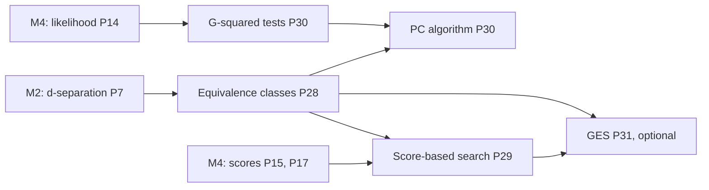

# ProbGraph — Milestone 7 Technical Specification (v1.0)

**Milestone:** Structure learning: equivalence classes, score-based search, and constraint-based
discovery.
**Release target:** `v0.7.0`.
**Status:** Accepted 2026-10-10. All §9 decisions are confirmed with their proposed defaults.
**Primary objective:** Learn the **graph** of a Bayesian network from data, not just its parameters.
Represent what data can and cannot determine (Markov equivalence classes), search for high-scoring
graphs with provable local and global guarantees, and discover structure from conditional-independence
tests. Test everything against exhaustive enumeration of all DAGs on small node sets, and against a
perfect independence oracle derived from d-separation.

---

## 1. What we are building

M4 could score a graph (BIC, BDeu) and choose among candidates you supplied. M7 finds the graph.

1. **Equivalence classes.** Data cannot distinguish Markov-equivalent DAGs (M4's BDeu and BIC score
   them identically). The object that data *can* identify is the **CPDAG** (essential graph): the
   skeleton plus the v-structures, closed under Meek's orientation rules. The library computes it,
   tests equivalence, and extends a CPDAG back to a member DAG.
2. **Score-based search.** **Greedy hill climbing** over add, delete and reverse moves. Decomposability
   (M4, S2) makes each move cost one or two family rescorings. It has tabu and random-restart options,
   because plain greedy search stops in local optima. An **exact** dynamic program over variable subsets
   finds the global optimum for small networks, and serves as the oracle for the greedy search.
3. **Constraint-based discovery.** **G² conditional-independence tests**, with exact chi-square tails,
   and the **PC algorithm** (the order-independent PC-stable variant). With a perfect independence
   oracle it returns exactly the true CPDAG. With data it is a consistent estimator.

An **optional** task adds **greedy equivalence search (GES)**, which searches over CPDAGs directly and is
consistent in the large-sample limit, where hill climbing over DAGs is not guaranteed to be.

### Mathematical dependency map



## 2. Scope

| Included in Milestone 7 | Deferred |
|---|---|
| CPDAGs: from a DAG, Markov-equivalence tests, consistent extensions, enumerating a class (small) | Background knowledge beyond required and forbidden edges |
| Hill climbing (add, delete, reverse) with tabu, restarts, max parents, required and forbidden edges | Simulated annealing, MCMC over structures, order-based MCMC |
| Exact optimal search by dynamic programming over subsets (about 12 variables) | Integer programming (GOBNILP), A* search |
| G² conditional-independence tests with exact chi-square tails | Kernel or continuous tests, permutation tests |
| PC-stable with Meek rules; an oracle mode using d-separation | FCI (latent variables, PAGs), causal sufficiency violations |
| Structural Hamming distance between CPDAGs | Causal effect estimation (a later milestone) |
| *(optional)* Greedy equivalence search | Hybrid methods (MMHC) |

### Non-negotiable requirements (carried over)

- No probabilistic-programming or graphical-model library. NumPy only for arrays and arithmetic;
  `math` for erfc and log-gamma.
- Every algorithm has a written proof in `docs/mathematics/` before it is implemented.
- Results are checked against **independent oracles**: every DAG on up to 5 nodes, enumerated; exact
  search against exhaustive scoring; PC against a d-separation oracle; recovery from data sampled from
  known networks.
- Each unit deliberately breaks its own code to confirm the tests notice ("mutation checks").
- Strict mypy under both Python 3.11/NumPy 2.4 and 3.12, run so that failures stop the chain. No
  Claude attribution in commits.

---

## 3. Interfaces and mathematical contracts

### 3.1 Equivalence classes

```python
# probgraph.structure
@dataclass(frozen=True)
class PDAG:
    nodes: tuple[str, ...]
    directed: frozenset[tuple[str, str]]
    undirected: frozenset[frozenset[str]]
    def consistent_extension(self) -> DAG: ...      # a member DAG (Dor–Tarsi); raises if none exists
    def members(self, limit: int = 10_000) -> Iterator[DAG]: ...   # every DAG in the class

def cpdag(dag: DAG) -> PDAG: ...                    # skeleton + v-structures, closed under Meek R1–R3
def markov_equivalent(a: DAG, b: DAG) -> bool: ...
def structural_hamming_distance(a: PDAG, b: PDAG) -> int: ...
```

| ID | Statement |
|---|---|
| E1 | **Verma–Pearl:** two DAGs are Markov equivalent iff they have the same skeleton and v-structures; then `cpdag(a) == cpdag(b)`. Checked over every DAG on 3, 4 and 5 nodes. |
| E2 | **Compelled edges:** an edge of `cpdag(G)` is directed iff it has the same orientation in every DAG of the class; undirected iff both orientations occur. Checked exhaustively on 4 nodes. |
| E3 | `consistent_extension` returns a DAG in the class; `members` yields exactly the class (its size matches the enumeration). |
| E4 | The number of classes on 1–5 labelled nodes is 1, 2, 11, 185, 8782, for 1, 3, 25, 543, 29281 DAGs (fixture F1). |

### 3.2 Score-based search

```python
@dataclass(frozen=True)
class SearchResult:
    structure: BayesianNetwork          # the graph only, ready for maximum_likelihood
    score: float
    history: tuple[float, ...]          # score after each accepted move (hill climbing)
    evaluations: int                    # family-score evaluations (cache misses)

def hill_climb(data, score: Literal["bic", "bdeu"] = "bic", equivalent_sample_size=1.0,
               start: BayesianNetwork | None = None, max_parents: int | None = None,
               required=(), forbidden=(), tabu_length: int = 0, restarts: int = 0,
               seed: int | None = None, max_iterations: int = 1000) -> SearchResult: ...
def exact_search(data, score="bic", equivalent_sample_size=1.0,
                 max_parents: int | None = None) -> SearchResult: ...   # optimal; ≤ 12 variables
```

| ID | Statement |
|---|---|
| S1 | **Deltas:** each move's score change, computed from one (add, delete) or two (reverse) cached family scores, equals the full rescoring. |
| S2 | **Monotone:** without tabu, `history` strictly increases; the result is a **local optimum** (no single legal move improves it). With tabu, the best graph seen is returned. |
| S3 | **Exact search is optimal:** its score equals the maximum over every DAG (exhaustive on 4–5 nodes), for BIC and BDeu, with and without `max_parents`. |
| S4 | **Greedy can be trapped:** on random 4-variable problems, plain hill climbing ends below the exact optimum a substantial fraction of the time (fixture F5); restarts and tabu reduce it. |
| S5 | **Consistency:** with enough data from a known network, the exact optimum is in the true equivalence class (structural Hamming distance 0 between CPDAGs). |
| S6 | Acyclicity, `max_parents`, `required` and `forbidden` are respected by every move. |

### 3.3 Independence tests and the PC algorithm

```python
@dataclass(frozen=True)
class IndependenceTest:
    statistic: float     # G² = 2 Σ O log(O / E) = 2 N · I(X; Y | Z), in nats
    dof: int
    p_value: float

def chi_square_survival(x: float, dof: int) -> float: ...
def g_squared_test(data: Dataset, x: str, y: str, given: Sequence[str] = ()) -> IndependenceTest: ...

@dataclass(frozen=True)
class PCResult:
    cpdag: PDAG
    separating_sets: Mapping[frozenset[str], frozenset[str]]
    tests: int
    conflicts: int

def pc(variables: Sequence[str], independent: Callable[[str, str, frozenset[str]], bool],
       max_condition_size: int | None = None) -> PCResult: ...
def pc_from_data(data: Dataset, alpha: float = 0.05, max_condition_size: int | None = None) -> PCResult: ...
def pc_oracle(dag: DAG) -> PCResult: ...    # independence = d-separation in `dag`
```

| ID | Statement |
|---|---|
| T1 | `chi_square_survival` matches the closed forms (Poisson sums for even dof, erfc plus a sum for odd), the standard critical values, and stays accurate in the far tail (log-space sums). |
| T2 | **G² by hand** (fixture F3), and $G^2=2N\cdot\hat I(X;Y\mid Z)$ against conditional mutual information computed from counts. |
| T3 | **Calibration:** under independence (data sampled from a model where $X\perp Y\mid Z$), p-values are approximately uniform: about 5% fall below 0.05. |
| P1 | **Oracle correctness:** `pc_oracle(G)` returns exactly `cpdag(G)` for **every** DAG on 4 nodes, and for random DAGs on up to 8 nodes. |
| P2 | **Order independence:** PC-stable's skeleton does not depend on the order of the variables. |
| P3 | **Recovery from data:** on large samples from known networks, `pc_from_data` recovers the true CPDAG, or a near miss with small structural Hamming distance at moderate N. |

### 3.4 *(optional)* Greedy equivalence search

| ID | Statement |
|---|---|
| G1 | Forward (insert) then backward (delete) phases over CPDAGs; the result's score is a local optimum among CPDAGs reachable by one insertion or deletion. |
| G2 | With a perfect-score oracle (exact BDeu on the true distribution), GES returns the true CPDAG on small networks. |

---

## 4. Mathematical test fixtures

All values below were computed during planning.

**F1: counting equivalence classes.** Labelled DAGs on $n=1..5$ nodes: 1, 3, 25, 543, 29281 (OEIS
A003024). Markov equivalence classes, grouped by skeleton and v-structures: 1, 2, 11, 185, 8782.

**F2: the late network's CPDAG.** Rain → Traffic ← Accident is a v-structure, so both edges are
compelled. Traffic → Late is then compelled by Meek's rule 1, since Late is adjacent to neither Rain nor
Accident. Rain – Umbrella stays undirected. The class has exactly 2 members: Rain → Umbrella and
Umbrella → Rain.

**F3: G² by hand.** The 2×2 table $\begin{pmatrix}30&10\\10&30\end{pmatrix}$ has expected counts 20 everywhere:
$G^2=2(60\ln1.5+20\ln0.5)=20.929926$, with 1 dof and p-value $\operatorname{erfc}(\sqrt{G^2/2})=4.763938\times10^{-6}$.
Pearson's $\chi^2$ for comparison is 20.

**F4: chi-square tails.** $Q_{\chi^2_1}(3.841459)=Q_{\chi^2_2}(5.991465)=Q_{\chi^2_3}(7.814728)=Q_{\chi^2_4}(9.487729)=0.05$.

**F5: greedy traps.** For 60 random 4-variable networks (2–3 states, 300 sampled rows, BIC), plain greedy
hill climbing from the empty graph ended below the exhaustive optimum in 16 cases, by up to 5.65 BIC
points. The exact value depends on move ordering; the tests use the statistic, with the exhaustive
optimum computed in the test.

**F6: the PC oracle.** For every one of the 543 DAGs on 4 nodes, PC with a d-separation oracle returns
the DAG's CPDAG exactly.

---

## 5. Proofs required

| Proof | Content |
|---|---|
| **P28 Equivalence classes** | Verma–Pearl (stated, with the direction "same skeleton and v-structures ⇒ same d-separations" proved); compelled and reversible edges; Meek's rules R1–R3 and why each is forced; Meek's theorem that their closure gives the essential graph (stated); consistent extension (Dor–Tarsi) and why it succeeds on a CPDAG; covered edges and Chickering's transformational characterisation (M4 link). |
| **P29 Score-based search** | Decomposability gives local deltas (M4 S2); hill climbing terminates at a local optimum; the exact dynamic program over subsets (best parent sets, then best orders), with its correctness proof and $O(n2^n)$ structure; why greedy DAG search can be trapped; consistency of the optimum (stated, via M4 P17). |
| **P30 Independence tests and PC** | G² as a likelihood-ratio test, and $G^2=2N\hat I(X;Y\mid Z)$; Wilks gives $\chi^2$ with $(|X|-1)(|Y|-1)\prod|Z|$ dof, adjusted for empty strata; exact chi-square tails for integer dof; the PC algorithm's correctness with a perfect oracle under faithfulness (skeleton: adjacent iff no separating set; v-structures from separating sets; Meek closure); PC-stable's order independence; multiple testing caveats. |
| **P31 GES** *(optional)* | Insert and delete operators on CPDAGs, validity conditions, and consistency (Chickering 2002, stated). |

New files: `docs/mathematics/equivalence_classes.md`, `structure_search.md`, `pc_algorithm.md`, and
`ges.md` (optional).

---

## 6. Implementation sequence

| # | Task | Completion criterion |
|---|---|---|
| 1 | **PDAG and CPDAG**: Meek rules, equivalence, extension, enumeration, SHD | E1–E4; F1, F2 |
| 2 | **Hill climbing**: cached family deltas, moves, constraints, tabu, restarts | S1, S2, S6 |
| 3 | **Exact search**: dynamic programming over subsets | S3, S4 (with 2), S5; F5 |
| 4 | **Independence tests**: chi-square tails, G² with adjusted dof, calibration | T1–T3; F3, F4 |
| 5 | **PC-stable** with the oracle | P1, P2; F6 |
| 6 | **PC from data** and recovery experiments | P3 |
| 7 | *(optional)* **GES** | G1, G2 |
| 8 | **Package and document v0.7.0**: example, README, changelog, CI | The full CI matrix passes |

---

## 7. Acceptance criteria for Milestone 7

- [ ] CPDAGs characterise equivalence exactly, over every DAG on up to 5 nodes, with compelled edges verified exhaustively.
- [ ] Hill climbing's deltas equal full rescoring; it ends at a verified local optimum and respects every constraint.
- [ ] Exact search equals the exhaustive optimum; greedy traps are measured, and reduced by restarts and tabu.
- [ ] The chi-square tails and G² match closed forms and hand calculations; p-values are calibrated under independence.
- [ ] PC with a d-separation oracle returns the exact CPDAG for every 4-node DAG; its skeleton is order-independent.
- [ ] Score-based and constraint-based learning recover known networks' equivalence classes from data.
- [ ] Proofs P28–P30 (and P31 if task 7 is done) are documented.
- [ ] `v0.7.0` passes the full CI matrix.

---

## 8. Repository additions

```
src/probgraph/structure/
├── __init__.py
├── pdag.py               # PDAG, cpdag, markov_equivalent, structural_hamming_distance
├── search.py             # hill_climb, exact_search, SearchResult
├── independence.py       # chi_square_survival, g_squared_test, IndependenceTest
├── pc.py                 # pc, pc_from_data, pc_oracle, PCResult
└── ges.py                # (task 7)
tests/
├── test_pdag.py
├── test_hill_climb.py
├── test_exact_search.py
├── test_independence.py
├── test_pc.py
├── test_structure_recovery.py
└── test_ges.py           # (task 7)
docs/mathematics/
├── equivalence_classes.md
├── structure_search.md
├── pc_algorithm.md
└── ges.md                # (task 7)
examples/
└── structure_discovery.py   # learn the late network's graph back: search, PC, and what data cannot decide
```

---

## 9. Decisions (accepted 2026-10-10)

| ⚑ | Decision | Accepted | Why |
|---|---|---|---|
| 1 | Approaches | **Both score-based (hill climbing and exact search) and constraint-based (PC)**; GES optional | They answer the same question from different assumptions, and each is the other's sanity check |
| 2 | Default score | **BIC**; BDeu with `equivalent_sample_size` on request | Consistent and free of hyperparameters; BDeu is there for its Bayesian interpretation |
| 3 | Hill-climbing defaults | **Add, delete and reverse; tabu and restarts off by default** (opt in); deterministic tie-breaking in a fixed move order; at most 1,000 iterations | Plain greedy behaviour is the honest baseline (F5); the escapes are explicit |
| 4 | Exact search limit | **At most 12 variables** (raise beyond), with an optional `max_parents` | The DP needs $n2^{n-1}$ parent-set scores; 12 keeps it to seconds |
| 5 | CI test | **G² only**, with dof $(|X|-1)(|Y|-1)$ summed over non-empty strata of $Z$, using each stratum's non-empty margins | G² is the likelihood-ratio statistic, equal to $2N\hat I$; adjusting the dof avoids anti-conservative tests on sparse tables |
| 6 | Chi-square tails | **Exact finite sums for integer dof, in log space** (Poisson sums; erfc for odd dof) | No special-function library; exact rather than approximated |
| 7 | PC variant | **PC-stable**, then v-structures from separating sets, then Meek R1–R3; orientation conflicts keep the first orientation in a fixed order and are counted | Order-independent skeleton; the conflict count makes unreliable orientations visible |
| 8 | Significance level | **α = 0.05** | The conventional default; the tests show its effect |
| 9 | CPDAG construction | **Skeleton plus v-structures, closed under Meek R1–R3**; extensions by Dor–Tarsi | Meek's rules are complete for this case and easy to prove one at a time |
| 10 | Include GES (task 7)? | **Yes, last and cuttable** | It is the consistent score-based method, and builds directly on P28 |

---

## 10. Where to begin

Start with **task 1** and **P28**. Before writing code, take the late network, list its skeleton and
v-structures by hand, apply Meek's rule 1 to orient Traffic → Late, and check that the class has exactly
two members. Then group all 25 DAGs on 3 nodes by skeleton and v-structures, and confirm that there are
11 classes.
